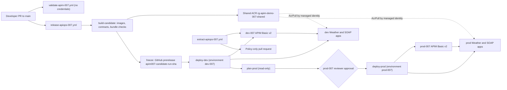

## Status

> [!NOTE]
> Runtime acceptance passed on 2026-10-07: baseline A, the A-to-B promotion, extraction, rollback, roll forward, both failure tests and the dev teardown rehearsal all ran against dev-007 and prod-007.

| Evidence                       | Value                                                                                                   |
|--------------------------------|---------------------------------------------------------------------------------------------------------|
| Contract capture run           | `37554025334`                                                                                           |
| Baseline A release             | Run `37610973282`, candidate `apim007-candidate-6-51da660`, `x-demo-release: baseline-a` in both        |
| A-to-B promotion               | Run `37616892784`: dev showed `candidate-b` while prod still showed `baseline-a`; prod after approval   |
| Extraction to pull request     | Run `37618679494` projected a dev portal header edit into `apis/weather/policy.xml` on a pushed branch  |
| Rollback by candidate tag      | Run `37618926825` to `apim007-candidate-6-51da660`; both environments back to `baseline-a`              |
| Extraction refusal             | Run `37619952350` failed with "dev is not running main" while dev ran the rollback                      |
| Roll forward                   | Run `37620134897` from `main`; both environments back to `candidate-b`                                  |
| Unknown and untrusted tags     | Runs `37621756882` (no release) and `37621889176` (not in history) failed before any write               |
| Simulated dev gate failure     | Run `37622061716`: dev `dirty`, prod jobs skipped; reconciled by run `37622712361`                      |
| Dev teardown rehearsal         | Run `37624727789`; prod untouched; Owner purge and AcrPull cleanup; restored by infra run `37626106546` |
| Final state                    | Run `37626771947`: both `clean` on `apim007-candidate-14-f77793e`, gateway tests pass                   |
| dev-007 gateway                | `https://apim-dev-007-uovzcyp6yypu2.azure-api.net`                                                      |
| prod-007 gateway               | `https://apim-prod-007-p4afmw2tk5j4m.azure-api.net`                                                     |
| Prod self-review               | `prevent_self_review=false` (solo presenter, reduced control)                                           |

Issues found and fixed during the runtime runs: leftover native exit codes after tolerated `az` not-found lookups, `approvalRequired` rejected on a product without subscriptions, server defaults in the extraction comparison (`isAgent`, omitted `http` API type, the built-in `administrators` product group), `peter-evans/create-pull-request` missing from the organization allowed-actions list, and a teardown plan ID collapsed to a string.

## Purpose

Instance 007 demonstrates the Microsoft product-group APIops CLI (`@azure-tools/apiops-cli` 1.0.4) promoting API Management configuration from a dev service to a prod service. Two fresh Basic v2 services, dev-007 and prod-007, each front their own Weather REST and SoftwareVersion SOAP backends built from `src/`.

Every release produces one frozen candidate: the environment-neutral bundle in `artifacts.007/`, the ownership filter, the expected inventory, the locked CLI tooling, the release scripts and the two backend image digests. The same candidate passes dev tests, waits for a prod approval and then reaches prod unchanged except for generated environment overrides. Instances 005 and 006 and their workflows are untouched.

## Scope and limits

### What the lab demonstrates

* Immutable candidate promotion from dev to prod behind a GitHub environment approval
* An observable policy change (`x-demo-release` header) that reaches dev first while prod keeps the previous release until approval
* Rollback to an earlier clean candidate and roll forward to `main`
* Dev-only extraction of a portal policy edit into a pull request
* Exact-ID, per-environment teardown

### What the lab does not claim

* It is an anonymous lab, not secured production. The Weather and SoftwareVersion APIs have subscription enforcement disabled and no subscription keys. Only the AI gateway API requires keys, through the `team-retail` and `team-finance` products.
* The backends are public and anonymous, so callers can bypass APIM and call the App Service hosts directly. The AI accounts are not anonymous: local (key) authentication is disabled and only managed identities with data roles can call them.
* Routing evidence is limited. The `x-demo-backend-host` response header plus the comparison of extracted service and backend URLs with the target manifest show where APIM sends requests. Headers alone do not prove backend isolation, and no correlated per-app request evidence is collected.
* Do not introduce sensitive data or production traffic. The AI gateway calls a paid Azure OpenAI deployment; tests send short prompts with small `max_tokens`. Private networking for the AI accounts requires a separate security design.

## Architecture



All resources live in `canadacentral` by default and carry the tags `apimDemo=007`, `environment` and `expiresOn`.

| Resource group                   | Contents                                                                           |
|----------------------------------|------------------------------------------------------------------------------------|
| `rg-apim-demo-007-shared`        | Container registry (Basic, admin user and anonymous pull disabled), identities     |
| `rg-apim-demo-007-dev-apim`      | dev-007 APIM, Application Insights, Log Analytics workspace                        |
| `rg-apim-demo-007-dev-backends`  | B1 Linux plan, `app-apim007-dev-weather-*`, `app-apim007-dev-software-version-*`   |
| `rg-apim-demo-007-prod-apim`     | prod-007 APIM, Application Insights, Log Analytics workspace                       |
| `rg-apim-demo-007-prod-backends` | B1 Linux plan, `app-apim007-prod-weather-*`, `app-apim007-prod-software-version-*` |

The APIM name is `apim-<env>-007-<uniqueString(resource group ID)>`, so a re-created service in the same resource group reuses the same name. Backend apps pull their images by digest with their system-assigned identity, enforce HTTPS only and TLS 1.2, and disable FTP and SCM basic publishing credentials.

### Repository assets

| Path                                        | Role                                                                             |
|---------------------------------------------|----------------------------------------------------------------------------------|
| `artifacts.007/`                            | Native, environment-neutral bundle: 3 APIs, 4 backends, 3 products, named values |
| `configuration.007.ownership.yaml`          | Ownership filter passed to every publish and extract (LF, hash-pinned)           |
| `configuration.007.expected-inventory.json` | Independent expected inventory used by bundle, override and extraction checks    |
| `configuration.007.ai-settings.json`        | Per-environment AI token limits, safety threshold and blocklist fixture          |
| `tools/apiops-cli/`                         | Exact CLI pin, committed lockfile, `.nvmrc` (Node 22)                            |
| `infra/apim-demo-007/`                      | Bicep for the registry, APIM and backends, plus `bootstrap-image.json`           |
| `scripts/apim-007/`                         | Release, validation and state scripts with Pester tests                          |
| `scripts/apim-007-setup/`                   | One-time Owner setup and Azure DevOps work item scripts                          |

The release scripts under `scripts/apim-007/` have these purposes:

* `ConvertTo-Apim007NeutralContract.ps1` normalizes captured OpenAPI and WSDL contracts into environment-neutral specifications.
* `Get-Apim007WsdlInfo.ps1` reads SOAP operations and actions from a WSDL.
* `Test-Apim007Bundle.ps1` validates the bundle against the expected inventory in `Authoring` or `Candidate` mode.
* `New-Apim007Candidate.ps1` and `Test-Apim007Candidate.ps1` build and verify the frozen candidate archive and manifest.
* `Get-Apim007TargetManifest.ps1` derives the exact target resource IDs and URLs from the fixed deployments `apim007-apim-<env>` and `apim007-backends-<env>`.
* `New-Apim007Overrides.ps1` generates the per-environment override file from the target manifest.
* `Get-Apim007ReleaseState.ps1` and `Set-Apim007ReleaseState.ps1` read, gate and write the release state named value.
* `Test-Apim007Backend.ps1` and `Test-Apim007Gateway.ps1` run direct backend tests and gateway tests with header assertions.
* `Compare-Apim007Extraction.ps1` compares a fresh extraction with the bundle and projects allowed policy edits.
* `Test-Apim007ServiceState.ps1` fingerprints protected service properties (instrumentation key, logger, metrics diagnostic) before publishing and verifies them and every product's API links afterwards.
* `Set-Apim007SafetyBlocklist.ps1` creates the content safety blocklist and its fixture term (infra workflow).
* `Set-Apim007TeamSubscriptions.ps1` creates one product-scoped subscription per AI team; keys never leave APIM.
* `Test-Apim007AiGateway.ps1` runs the AI gateway tests and the token metric check.

### Workflows

| Workflow                 | Trigger                                                       | GitHub environments                                        | Purpose                                                                         |
|--------------------------|---------------------------------------------------------------|------------------------------------------------------------|---------------------------------------------------------------------------------|
| `validate-apim-007.yml`  | Pull requests touching 007 paths, manual                      | None                                                       | Legacy path guard, SHA pins, forbidden patterns, Bicep, tooling, Pester, bundle |
| `infra-apim-007.yml`     | Manual, `target` = `shared`, `dev` or `prod`                  | `apim-007-shared-infra`, `dev-007-infra`, `prod-007-infra` | Hosting and AI provisioning, AcrPull grants, content safety blocklist           |
| `release-apiops-007.yml` | Push to `main` on 007 bundle, tooling or script paths; manual | `apim-007-build`, `dev-007`, `prod-007-plan`, `prod-007`   | Build, freeze, dev deploy, prod plan, approved prod deploy, rollback            |
| `extract-apiops-007.yml` | Manual                                                        | `dev-007`                                                  | Dev extraction projected into a policy-only pull request                        |
| `teardown-apim-007.yml`  | Manual, `environment` and `confirm` inputs                    | `dev-007-teardown`, `prod-007-teardown`                    | Exact-ID removal of one environment                                             |

Every credentialed 007 job is skipped until the repository variable `APIM007_ENABLED` equals `true`. The validation workflow has no credentials and is not gated.

## One-time setup

You need subscription Owner rights, GitHub repository admin rights, PowerShell 7.2 or later, the Azure CLI and the GitHub CLI. Read [scripts/apim-007-setup/README.md](../scripts/apim-007-setup/README.md) before running anything.

### Approve the bootstrap image

New backend apps start on a digest-pinned bootstrap image recorded in `infra/apim-demo-007/bootstrap-image.json`: the ASP.NET sample `mcr.microsoft.com/dotnet/samples` (tag `aspnetapp-8.0`) on port 8080. It only keeps fresh apps healthy until the first release; it is never a release candidate.

1. Review the image and its digest.
2. Replace `PENDING` in `approvedBy` and `approvedOn` with the approver and an ISO 8601 date.
3. Merge the change through a reviewed pull request.

`validate-apim-007.yml` fails and `infra-apim-007.yml` refuses to provision while either field is still `PENDING`. Provisioning never switches an existing app's image; it keeps the current digest-pinned image or uses the bootstrap image for a new app.

### Create the Azure DevOps work items

Work item creation was deferred because Azure DevOps was not reachable from the implementation machine. Run the script from a machine signed in to `devopsabcs`:

```powershell
./scripts/apim-007-setup/New-Apim007WorkItems.ps1 -WhatIf
./scripts/apim-007-setup/New-Apim007WorkItems.ps1
```

It creates or reuses the Epic, the Feature and User Stories S1 to S5 in `OneProject` with the `Agentic AI` tag and the API Management area path, then writes `apim007-work-items.json` with the suggested `feature/<id>-apim007-*` branch names. Pass `-ExistingEpicId` to reuse an existing APIOps Epic.

### Provisioning order

Run each step only after explicit approval; each one creates billable resources or changes repository settings.

1. Run `Initialize-Apim007Environment.ps1 -Stage Initial -WhatIf`, review the cost table, budget, expiry date, prod reviewers and self-review choice, then run it without `-WhatIf`.
2. Run `infra-apim-007.yml` with `target=shared` to deploy the registry.
3. Run `Initialize-Apim007Environment.ps1 -Stage PostRegistry -RegistryName <registryName> -WhatIf`, then run it without `-WhatIf`.
4. Run `infra-apim-007.yml` with `target=dev`, then with `target=prod`.

```powershell
./scripts/apim-007-setup/Initialize-Apim007Environment.ps1 -Stage Initial `
    -SubscriptionId <subscription-id> -TenantId <tenant-id> `
    -GitHubRepository devopsabcs-engineering/APIM_apim-landing-zone-accelerator `
    -BudgetAmount 150 -BudgetAlertEmail <email> -ExpiresOn 2026-12-31 `
    -ProdReviewers <github-login> -WhatIf
```

The `Initial` stage registers resource providers, checks Basic v2 availability, creates the five tagged resource groups, one subscription budget filtered on `apimDemo=007`, the user-assigned identities with one federated credential each, ABAC-constrained role assignments and the nine GitHub environments. It tries to enable "Allow GitHub Actions to create and approve pull requests" (only a warning when organization or enterprise policy blocks it), attempts to enable immutable releases, records `APIM007_PREVENT_SELF_REVIEW` and finally sets `APIM007_ENABLED=true`. The `PostRegistry` stage grants the dev and prod infra identities an AcrPull-only RBAC Administrator assignment on the registry and publishes `REGISTRY_NAME`, `REGISTRY_LOGIN_SERVER` and `REGISTRY_ID`.

The script refuses to continue when a `rg-apim-demo-007-*` resource group exists without the `apimDemo=007` tag, and it never deletes resources. After `target=dev` and `target=prod`, both environments run the bootstrap image and the workflow summary lists the target manifest.

### Identities and environments

| Identity                    | GitHub environment      | Rights                                                                                                        |
|-----------------------------|-------------------------|---------------------------------------------------------------------------------------------------------------|
| `id-apim007-shared-infra`   | `apim-007-shared-infra` | Contributor on the shared group; RBAC Administrator limited to AcrPush and AcrPull                            |
| `id-apim007-build`          | `apim-007-build`        | AcrPush on the registry                                                                                       |
| `id-apim007-<env>-infra`    | `<env>-007-infra`       | Contributor on the environment groups; constrained RBAC Administrator; AcrPull-only on the registry           |
| `id-apim007-<env>-release`  | `dev-007`, `prod-007`   | API Management Service Contributor, Reader, Website Contributor; Reader on the other environment's APIM group |
| `id-apim007-prod-plan`      | `prod-007-plan`         | Reader on the prod groups and on `rg-apim-demo-007-dev-apim`                                                  |
| `id-apim007-<env>-teardown` | `<env>-007-teardown`    | Contributor on the environment groups only                                                                    |

Each environment holds the secrets `AZURE_CLIENT_ID`, `AZURE_TENANT_ID` and `AZURE_SUBSCRIPTION_ID` and the variables `EXPECTED_TENANT_ID` and `EXPECTED_SUBSCRIPTION_ID`. Every credentialed job fails when the signed-in tenant or subscription differs from those variables. All nine environments allow only the `main` branch.

### Prod approval model

`prod-007` and `prod-007-teardown` require the reviewers passed in `-ProdReviewers`, set `can_admins_bypass` to `false` and use `prevent_self_review` from `-PreventSelfReview` (default `$true`). Before the approval prompt appears, `plan-prod` reads the `prod-007` environment and fails unless it has required reviewers, `prevent_self_review` equals `APIM007_PREVENT_SELF_REVIEW`, administrators cannot bypass and the only branch policy is `main`.

> [!CAUTION]
> A solo presenter can pass `-PreventSelfReview $false` to approve their own prod release. That is reduced control: one person can author, merge and approve the same change. The choice is recorded in `APIM007_PREVENT_SELF_REVIEW` and must be stated when presenting the demo.

## Contract capture

`apis/weather/specification.json` and `apis/software-version/specification.wsdl` in `artifacts.007/` must come from the real images, not from hand edits. Repeat this procedure whenever a backend contract changes.

1. Dispatch `release-apiops-007.yml` with `capture_contracts_only=true`.
2. Only `build-candidate` runs. It builds both images without credentials, runs them locally, fetches `/swagger/v1/swagger.json` and `/SoftwareVersionService.asmx?wsdl`, normalizes them, runs direct backend tests and uploads the `captured-contracts` artifact (14-day retention).
3. Review the OpenAPI and WSDL files: operations, SOAP actions and the absence of external imports.
4. Commit them to the two specification paths in a reviewed pull request. Update the SOAP operation names and file list in `configuration.007.expected-inventory.json` if they differ.

A normal release fails at "Fail on contract drift" whenever the committed specifications are missing or differ from the captured contracts, and it uploads the captured files for the same review.

## Baseline A release

Merging the specification pull request to `main` changes `artifacts.007/**`, which triggers `release-apiops-007.yml`. The committed policies set `x-demo-release` to `baseline-a`.

1. `build-candidate` builds and tests the images and validates the bundle in `Candidate` mode.
2. `push-images` pushes `apim007-weather` and `apim007-soap` with the AcrPush-only identity and outputs digest references.
3. `freeze` creates the candidate and publishes `candidate.tar.gz` and `candidate-manifest.json` as a GitHub prerelease tagged `apim007-candidate-<run_number>-<shortsha>`.
4. `deploy-dev` verifies the candidate, marks the release state `deploying`, rolls out both images by digest, checks the observed `linuxFxVersion`, runs direct tests, generates overrides, runs a CLI dry run, a full publish and a fresh extraction, compares the extraction and protected service state, runs gateway tests, publishes a second time, tests again and marks the state `clean`.
5. `plan-prod` re-verifies the candidate, generates prod overrides, checks the dev and prod release states and the `prod-007` protection, and writes a summary table for the approver.
6. Approve `prod-007` only if the summary matches the candidate you expect. `deploy-prod` recomputes the manifest and override hashes, fails if they differ from the plan, then repeats the dev rollout and gates against prod.

Each deploy job writes a receipt (candidate tag and hash, source SHA, app version, image digests, APIM name, gateway URL, manifest and override hashes, run ID) to its step summary and uploads it as `receipt-dev-007` or `receipt-prod-007`.

## A-to-B demo script

Use the gateway URLs from the receipts. Check headers with:

```bash
curl -s -D - -o /dev/null "https://<dev-gateway>/weather/api/Version" | grep -i '^x-demo-'
curl -s -D - -o /dev/null "https://<prod-gateway>/weather/api/Version" | grep -i '^x-demo-'
```

Expect `x-demo-environment` to show the target environment, `x-demo-release` to show the release and `x-demo-backend-host` to show that environment's Weather host.

1. Show baseline A: both gateways return `x-demo-release: baseline-a`.
2. Open a pull request that changes the literal `x-demo-release` value from `baseline-a` to `candidate-b` in both `artifacts.007/apis/weather/policy.xml` and `artifacts.007/apis/software-version/policy.xml`. Merge it after validation.
3. While `deploy-prod` waits for approval, show dev returning `candidate-b` and prod still returning `baseline-a`.
4. Approve `prod-007` and show prod returning `candidate-b`.
5. Run the extraction flow in [Extraction to pull request](#extraction-to-pull-request) while dev runs `main`.
6. Roll back to the baseline candidate tag as described in [Rollback by candidate tag](#rollback-by-candidate-tag), approve and show `baseline-a` in both environments.
7. Show that `extract-apiops-007.yml` now refuses to run because dev no longer runs `main`.
8. Roll forward by dispatching `release-apiops-007.yml` from `main` without inputs, approve and show `candidate-b` in both environments.
9. Run the [failure and integrity tests](#failure-and-integrity-tests), then the dev teardown rehearsal in [Teardown](#teardown).

## AI gateway

The AI gateway adds an Azure OpenAI chat API to the same promotion flow. The policies, products and named values live in the bundle and promote like any other API; only the values differ per environment.

> [!NOTE]
> AI gateway runtime acceptance passed on 2026-10-07 in dev-007 and prod-007.

| Evidence                      | Value                                                                                                      |
|-------------------------------|------------------------------------------------------------------------------------------------------------|
| AI provisioning               | Infra runs `37652034002` (dev) and `37652742332` (prod): AI accounts, data roles, blocklist by infra identity |
| Baseline AI release           | Run `37660072964`: T1-T5 passed in dev and prod (401 / 200 / 429 / 403 / token metrics), `baseline-ai`       |
| AI A-to-B promotion           | Run `37663312626`: dev returned `ai-b` while prod returned `baseline-ai`; prod `ai-b` after approval; prod retail daily quota 40000 |
| Extraction                    | Run `37665255654`: no drift with product policies owned                                                    |
| Product policy projection     | Run `37665497460`: a dev edit of `team-retail` was projected into branch `apim007/extract-37665497460`        |
| Showback (`Total Tokens`)     | dev: team-finance 1661, team-retail 170; prod: team-finance 1097, team-retail 70                           |
| Rejected deployment           | Run `37658029033`: candidate carried AI scripts without the AI bundle; prod was rejected and the step guard fixed |

### AI resources

`infra-apim-007.yml` deploys `infra/apim-demo-007/ai.bicep` as `apim007-ai-<env>` into `rg-apim-demo-007-<env>-apim` (location `canadaeast`):

* An AIServices account with the deployment `chat` (`gpt-4o` 2024-11-20, Standard, capacity 10, no automatic version upgrade).
* A ContentSafety account.
* Both accounts disable local authentication. The APIM system-assigned identity gets Cognitive Services OpenAI User on the AIServices account and Cognitive Services User on the ContentSafety account. The infra identity gets Cognitive Services User on the ContentSafety account to write the blocklist.

The infra identity's RBAC Administrator condition on the APIM group allows only those two data roles for service principals, in addition to the release roles. Re-run the setup script `Initial` stage once before the first AI provisioning so the condition is in place.

After the deployment, `Set-Apim007SafetyBlocklist.ps1` creates the blocklist `apim007-demo` with the fixture term from `configuration.007.ai-settings.json`.

### AI bundle

| Item                                      | Purpose                                                                                              |
|-------------------------------------------|------------------------------------------------------------------------------------------------------|
| `apis/ai-gateway`                         | `POST /ai/chat/completions`, key required in the `api-key` header                                     |
| API policy                                | Strips the key, managed identity to `ai-foundry`, `llm-content-safety`, `llm-emit-token-metric`       |
| `backends/ai-foundry`                     | Chat deployment URL (override)                                                                       |
| `backends/ai-content-safety`              | Content safety endpoint (override) with managed identity credentials                                 |
| `products/team-retail`, `team-finance`    | `llm-token-limit` per subscription: tokens per minute and a daily quota from named values            |
| `ai-team-*`, `ai-safety-*` named values   | Sentinel `UNCONFIGURED` in the bundle; overrides fill them from `configuration.007.ai-settings.json` |

The client passes `api-version` in the query string. The policy does not set it, because the extractor redacts literal `<value>` elements of `set-query-parameter` and the extraction comparison would fail.

`New-Apim007Overrides.ps1` reads the AI section of the target manifest (derived from `apim007-ai-<env>`) and the AI settings, validates each value against a strict pattern and fails closed when the AI deployment is missing.

### Release behavior

After the extraction comparison, `deploy-dev` and `deploy-prod` run "AI gateway subscriptions and tests":

1. `Set-Apim007TeamSubscriptions.ps1` creates `sub-team-retail` and `sub-team-finance` scoped to their products. Subscriptions are created by script, never stored in the bundle.
2. `Test-Apim007AiGateway.ps1` reads the keys through ARM `listSecrets`, masks them and runs:
   * T1: no key returns 401.
   * T2: `team-retail` returns 200 with token usage, the `x-demo-*` headers and `remaining-tokens`.
   * T3: a `team-finance` burst returns 429 with `Retry-After` within 10 calls.
   * T4: the blocklist fixture term returns 403 with `x-content-safety-decision: blocked`.
   * T5: token metrics (`Total Tokens`, `Prompt Tokens`, `Completion Tokens`) arrive in the `AppMetrics` table (warning only).

The evidence goes into the receipt as `aiEvidence`. `plan-prod` lists the chat model, safety threshold and per-team prod limits for the approver. Rolling back to a candidate without the AI gateway skips the step and leaves the AI entities in place.

### AI A-to-B demo

1. Show `x-demo-release: baseline-ai` on the AI API in both environments.
2. In a pull request, change the AI policy `x-demo-release` literal to `ai-b` and lower a prod quota in `configuration.007.ai-settings.json`. Merge it.
3. While prod waits for approval, show dev returning `ai-b`, and show the new prod limit in the `plan-prod` summary.
4. Approve and show prod returning `ai-b`.

### Showback

Query token use per product in the environment's Log Analytics workspace:

```kusto
AppMetrics
| where TimeGenerated > ago(1d)
| where Name == 'Total Tokens'
| summarize tokens = sum(Sum) by product = tostring(Properties['Product ID']), bin(TimeGenerated, 1h)
```

## Release state

Each APIM service holds a non-secret named value `apim007-release-state`. It is outside the ownership filter, so publishing and extraction never touch it. Only release jobs write it, and only from the reviewed workflow checkout.

```json
{
  "candidateTag": "apim007-candidate-12-abcdef1",
  "candidateSha256": "<64 hex characters>",
  "sourceSha": "<40 hex characters>",
  "runId": "<workflow run ID>",
  "status": "clean",
  "updatedUtc": "2026-10-06T00:00:00Z",
  "history": [
    { "candidateTag": "...", "candidateSha256": "...", "sourceSha": "...", "cleanUtc": "..." }
  ]
}
```

### Status values

* `deploying` means a run is writing to the environment; `runId` identifies it.
* `clean` means the recorded candidate passed every gate; it is prepended to `history`, which keeps the last 10 distinct candidates.
* `dirty` means a run failed or was cancelled after writing `deploying`, so the environment content is unknown.
* A missing value means a fresh target with empty history.

### Gate rules

* `deploying` owned by an in-progress run blocks the next release; owned by a completed run, it is treated as `dirty`.
* Dev may deploy from `dirty`.
* Prod `dirty` blocks unless the candidate equals the failed attempt (a retry) or is a rollback to a history entry.
* `plan-prod` and `deploy-prod` require the dev state to be `clean` with exactly the candidate being promoted.

### Manual reconciliation

Read a state value with:

```powershell
az apim nv show --resource-group rg-apim-demo-007-dev-apim --service-name <apim-name> --named-value-id apim007-release-state --query value -o tsv
```

* Reconcile dev `dirty` by running a normal release from `main`.
* Reconcile prod `dirty` by re-running the failed run's jobs (same candidate) or by a rollback to a history entry.
* Do not hand-edit the value to `clean`. A hand-written hash would become a trusted rollback source.
* A malformed value fails every gate closed. Restoring it or removing it requires explicit Owner approval; removing it resets the target to fresh with empty history, so earlier candidates are no longer eligible for rollback.

## Extraction to pull request

`extract-apiops-007.yml` is manual and dev-only. It projects an approved dev portal edit of an API or product policy into `artifacts.007/apis/*/policy.xml` or `artifacts.007/products/*/policy.xml` and opens a pull request. Product policies are projected only for products whose inventory entry sets `"policy": true` (the AI team products).

The job refuses to run unless the dev release state is `clean` and the bundle, ownership filter, inventory, tooling and release scripts at the recorded source SHA are content-equal to `main` (documentation-only merges do not block). The failure message is "dev is not running main; release main first". This prevents an extraction pull request from reverting a newer `main` after a dev rollback.

1. Edit one policy header on a dev-007 API in the portal.
2. Dispatch `extract-apiops-007.yml`.
3. The job extracts with the ownership filter, scans for credential-like content, uploads the raw extraction as the `dev-007-extraction` artifact (evidence only, never committed), compares it with the bundle and projects only allowed policy edits.
4. With no drift, the summary reports "No drift". Otherwise the job runs Pester and the `Candidate` bundle check, uploads the projected policies as the `projected-policies` artifact, commits them with git to a new branch `apim007/extract-<run_id>` and attempts `gh pr create`. In this repository the enterprise policy blocks `GITHUB_TOKEN` from creating pull requests, so the step logs a warning and you open the pull request from that branch manually.
5. Pull requests created with `GITHUB_TOKEN` do not trigger workflows, so the pull request body states that checks ran in the extraction job. Close the pull request, or merge it as a new candidate that repeats dev validation before prod approval.

Endpoint, operation or schema drift fails the comparison instead of being normalized away.

## Rollback by candidate tag

Candidates are durable GitHub prerelease assets, so rollback does not depend on workflow artifact retention.

1. Find the candidate tag in an earlier receipt or in the release list.
2. Dispatch `release-apiops-007.yml` with `rollback_candidate_tag=<tag>`.
3. `build-candidate`, `push-images` and `freeze` are skipped. `deploy-dev` downloads the archive and trusts its SHA256 only if the tag and hash match an entry in the dev or prod `history`. Release assets alone are never trusted.
4. Dev deploys the rollback candidate, `plan-prod` summarizes it, and prod deploys it after approval.

A tag absent from both histories fails before any write. Only the last 10 clean candidates per environment are eligible. Rollback redeploys images and republishes the bundle with full tests; it is not an atomic restore and cannot remove resources introduced by a later candidate.

## Failure and integrity tests

* Dispatch a rollback with a well-formed tag absent from both histories. Expected: `deploy-dev` fails at the trusted-hash step before marking `deploying`.
* Dispatch a normal release with `simulate_dev_gate_failure=true`. Expected: dev publishes, the gateway test expects a release value the candidate does not set and fails, dev state becomes `dirty` and `plan-prod` and `deploy-prod` are skipped. The input only changes the dev gateway assertion; prod jobs ignore it.
* Reconcile afterwards with a normal release from `main`.

## Concurrency caveat

All writes to one environment share a concurrency group (`apim-007-dev-writes` or `apim-007-prod-writes`) with `cancel-in-progress: false`, across release, extraction, provisioning and teardown. Shared registry provisioning uses `apim-007-shared-writes`. GitHub keeps at most one pending job per group and cancels older pending ones. A cancelled queued release or rollback is a non-promotion: nothing was deployed, and you must re-run it. The release-state gate, not the lock, rejects stale or out-of-order candidates.

## Teardown

`teardown-apim-007.yml` removes one environment's APIM and backend hosting.

1. Dispatch it with `environment=dev` (or `prod`) and `confirm=delete-apim-007-dev` (or `delete-apim-007-prod`). Prod teardown requires reviewer approval.
2. The job derives the exact IDs of both apps, the App Service plan, APIM, Application Insights, the Log Analytics workspace and, when `apim007-ai-<env>` exists, the two AI accounts from the fixed deployments, verifies each one carries `apimDemo=007` and the matching `environment` tag in the expected resource group, removes them by ID and verifies they are gone.
3. Resource groups, release role assignments, identities, the budget and the shared registry are kept. Legacy 005 and 006 resources are never selected.

The summary lists follow-up actions for the Owner.

### Soft-deleted AI accounts

Removed AI accounts stay soft-deleted for 48 hours and block re-creation of the same names. To re-provision sooner, the Owner removes the records manually for each account listed in the teardown summary:

```powershell
az cognitiveservices account purge --location canadaeast --resource-group rg-apim-demo-007-<env>-apim --name <account>
```

### Soft-deleted APIM handling

A removed APIM service stays in a soft-delete state for its retention period (48 hours). Because the name is derived from the resource group ID, re-provisioning the same environment fails with a name conflict until that record is gone; `infra-apim-007.yml` reports the conflict and performs no automatic recovery. No 007 workflow ever removes soft-delete records.

Choose one of these options:

* Wait out the retention period, then re-provision.
* After explicit approval, an Owner permanently removes the soft-delete record for that exact name and location, taken from the teardown summary, and then re-provisions:

```bash
az apim deletedservice purge --service-name <apim-name-from-summary> --location <location-from-summary>
```

Never run this command with a name that does not come from the teardown summary. The Log Analytics workspace also enters a soft-delete retention window; Azure recovers it when the same name is re-created in the same resource group during that window.

### Orphaned AcrPull cleanup

Removing the apps deletes their system-assigned identities, which leaves their AcrPull assignments on the shared registry orphaned. The teardown summary lists the principal IDs. After confirming each assignment belongs to a removed 007 app, an Owner removes it:

```powershell
az role assignment list --scope <registry-id> --assignee-object-id <principal-id> --role AcrPull --query "[].id" -o tsv
az role assignment delete --ids <assignment-id>
```

Re-provisioning creates new identities and new AcrPull assignments.

## Known APIops CLI limits

* Dry run is planning only. It performs authenticated reads and reports intended actions; it does not validate writes on the server. The full publish and the gates that follow are the real checks.
* Publishing is not transactional. A partial failure marks the target `dirty` and needs reconciliation.
* Publishing a new product deletes the default group links that APIM creates automatically, even without unmatched-resource deletion. This is the only accepted association deletion; the extraction comparison fails on a nonempty product group set.
* The 007 workflows always run full publishes. Commit-scoped incremental publishing and unmatched-resource deletion are never used.
* The CLI does not read the legacy extractor layout used by instances 005 and 006 ([Azure/apiops-cli issue #304](https://github.com/Azure/apiops-cli/issues/304)), so 007 uses a fresh native bundle instead of converted artifacts.
* `npm audit` reports critical advisories in the transitive `simple-git` dependency with no fix available. The 007 workflows do not use the affected incremental code path or editor variables; see [tools/apiops-cli/README.md](../tools/apiops-cli/README.md) and reassess when a fixed release exists.
* Packages install through the anonymous 1ES public Azure Artifacts npm proxy feed configured in `tools/apiops-cli/.npmrc`. `npm audit signatures` cannot verify packages served by that feed, so every install first runs `scripts/apim-007/Test-Apim007LockfileProvenance.ps1`, which requires each lockfile sha512 integrity to equal the value published on registry.npmjs.org. `npm ci` then enforces those hashes.

## Cost and expiry

* The lab runs two APIM Basic v2 services, two B1 Linux App Service plans, one Basic container registry and two Application Insights and Log Analytics pairs. The setup script prints current prices at run time; APIM dominates the cost.
* The `Initial` stage requires `-BudgetAmount`, `-BudgetAlertEmail` and `-ExpiresOn`. The budget filters on the `apimDemo=007` tag, and every resource group carries the `expiresOn` tag.
* Tear down both environments when the demo ends or the expiry date passes. Teardown keeps the registry and resource groups, which cost little or nothing while empty.
* Plan around the APIM soft-delete retention period when you tear down and re-provision on the same day.

## AI Gateway outlook

A later phase may reuse the neutral bundle, override and ownership model for AI Gateway concepts from [AIGovernanceOffering](https://github.com/devopsabcs-engineering/AIGovernanceOffering): token limits and metrics, content safety, team products and resilient backend pools. Bicep would own Foundry and Content Safety resources, identities and selected monitoring, while APIops would own AI APIs, policies, backends and products. Before any AI traffic, verify policy and SKU support, model availability, cost caps, authentication, telemetry privacy and semantic extraction in both environments. Nothing in instance 007 implements or verifies AI Gateway behavior today.
