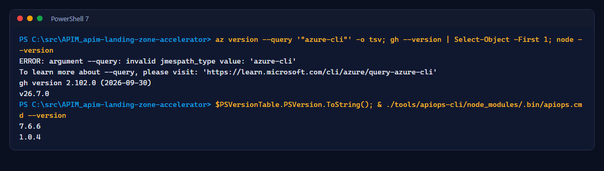
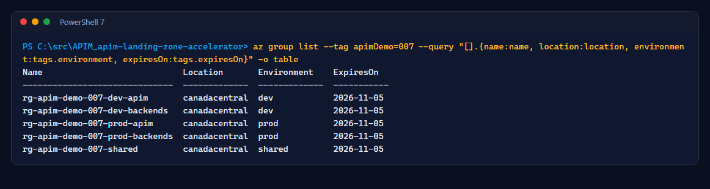
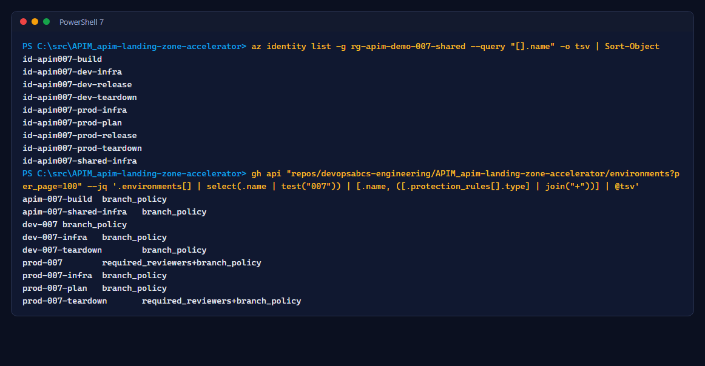

# Lab 0: Prerequisites and one-time setup

<span class="chip phase-prod"><span aria-hidden="true">🧰</span> Setup</span> <span class="chip phase-idea">45 min</span> <span class="chip phase-plan">Intermediate</span>

## Overview

<div class="lab-meta" markdown>

| Item | Details |
|------|---------|
| **Duration** | 45 minutes |
| **Level** | Intermediate |
| **Platform** | Windows 10 or 11, PowerShell 7, VS Code optional |
| **Prerequisites** | Owner on an Azure subscription, admin on a GitHub repository, GitHub Actions enabled |
| **Checkpoint** | Five tagged resource groups, nine user-assigned identities, nine GitHub environments, `APIM007_ENABLED=true` |
| **Next lab** | [Lab 1: Provision dev and prod](lab-01-infrastructure.md) |

</div>

No workflow can create its own identities or permissions. One Owner runs a setup script once; after that, every change goes through Git and GitHub Actions with narrow, federated identities and no secrets.

!!! tip "Starting over"
    If you ran the labs before, reset Azure first with [Lab 10, step 4](lab-10-teardown.md#step-4-reset-azure-to-a-clean-slate) and check that it leaves no 007 names. Then follow this lab as written.

## Learning objectives

By the end of this lab, you will be able to:

* Install and check the Azure CLI, GitHub CLI, Node.js 22 and PowerShell 7.
* Install the APIops CLI from a locked, verified lockfile.
* Explain why each GitHub environment has its own Azure identity.
* Run the setup script in `-WhatIf` mode, review the plan, then apply it.

## Steps

### Step 1: Install and check the tools

```powershell
winget install --id Microsoft.AzureCLI -e
winget install --id GitHub.cli -e
winget install --id OpenJS.NodeJS.22 -e
winget install --id Microsoft.PowerShell -e
```

Open a new PowerShell 7 terminal so the new `PATH` is loaded.

!!! warning "Use Node.js 22"
    The workflows run on Node.js 22, and `tools/apiops-cli` accepts only version 22. `OpenJS.NodeJS.LTS` now installs a newer version. If `node --version` does not start with `v22`, `npm ci` warns `EBADENGINE`. Find the other Node.js with `winget list --name Node.js`, remove it with `winget uninstall --id <id>` (or switch with a version manager), then open a new terminal and check again.

### Step 2: Copy the repository and set your session variables

Fork or import the repository into your organization, then clone it:

```powershell
$Org  = '<your-github-org>'
$Repo = "$Org/APIM_apim-landing-zone-accelerator"
gh repo fork devopsabcs-engineering/APIM_apim-landing-zone-accelerator --org $Org --clone
Set-Location APIM_apim-landing-zone-accelerator
```

Set these variables in every new terminal (replace the placeholders):

```powershell
$Org            = '<your-github-org>'
$Repo           = "$Org/APIM_apim-landing-zone-accelerator"
$SubscriptionId = '<subscription-id>'
$TenantId       = '<tenant-id>'
$Location       = 'canadacentral'
$Reviewer       = '<github-login-of-the-prod-approver>'
$AlertEmail     = '<email-for-budget-alerts>'
$PreventSelfReview = $true
```

`$Reviewer` is a GitHub **login** such as `octocat`, not an email address. To use your own, run `gh api user --jq .login` once you have signed in (Step 3). `$AlertEmail` receives the budget alerts. Remove the angle brackets: the setup script rejects any value that still contains `<` or `>`.

For a solo lab where you must approve your own deployments, set `$PreventSelfReview = $false` before previewing and applying setup. This is reduced control, not a production recommendation. Keep that same value for subsequent setup reruns, including Lab 7.

### Step 3: Sign in and install the APIops CLI

```powershell
az login --tenant $TenantId
az account set --subscription $SubscriptionId
gh auth login
Push-Location tools/apiops-cli
npm ci --ignore-scripts --no-audit --no-fund
Pop-Location
```

The CLI is pinned to `@azure-tools/apiops-cli` **1.0.4** with a committed lockfile. Workflows never download it on the fly. Check the versions:

```powershell
(az version -o json | ConvertFrom-Json).'azure-cli'; gh --version | Select-Object -First 1; node --version
$PSVersionTable.PSVersion.ToString(); & ./tools/apiops-cli/node_modules/.bin/apiops.cmd --version
```

<figure class="screenshot-frame" markdown>

<figcaption>Tool versions in the recorded run. Newer versions are fine; the APIops CLI must be 1.0.4.</figcaption>
</figure>

!!! success "Expected result"
    Five version lines, `v22` for Node.js and `1.0.4` for the APIops CLI. `npm ci` prints no `EBADENGINE` warning.

### Step 4: Preview the setup with -WhatIf

The setup script is idempotent and never deletes anything. Always preview first:

```powershell
./scripts/apim-007-setup/Initialize-Apim007Environment.ps1 -Stage Initial `
    -SubscriptionId $SubscriptionId -TenantId $TenantId -Location $Location `
    -GitHubRepository $Repo -BudgetAmount 150 -BudgetAlertEmail $AlertEmail `
    -ExpiresOn (Get-Date).AddDays(30).ToString('yyyy-MM-dd') -ProdReviewers $Reviewer `
    -PreventSelfReview $PreventSelfReview -WhatIf
```

Review the cost table, the budget, the role assignments and their ABAC conditions, and the GitHub environment protections.

!!! cost "What it costs"
    Two API Management Basic v2 services are the main cost. App Service B1 plans, a Basic container registry, Log Analytics ingestion and (from Lab 7) pay-per-use Azure OpenAI and Content Safety add a little. The budget alerts at the amount you choose; tear down with [Lab 10](lab-10-teardown.md) when you finish.

### Step 5: Apply the setup

Run the same command without `-WhatIf`. Say so when presenting if you chose `$PreventSelfReview = $false`: a single person can approve their own prod releases.

```powershell
./scripts/apim-007-setup/Initialize-Apim007Environment.ps1 -Stage Initial `
    -SubscriptionId $SubscriptionId -TenantId $TenantId -Location $Location `
    -GitHubRepository $Repo -BudgetAmount 150 -BudgetAlertEmail $AlertEmail `
    -ExpiresOn (Get-Date).AddDays(30).ToString('yyyy-MM-dd') -ProdReviewers $Reviewer `
    -PreventSelfReview $PreventSelfReview
```

### Step 6: Check the resource groups, identities and environments

```powershell
az group list --tag apimDemo=007 --query "[].{name:name, location:location, environment:tags.environment, expiresOn:tags.expiresOn}" -o table
```

<figure class="screenshot-frame" markdown>

<figcaption>Five tagged resource groups. Every workflow refuses to touch a group without the <code>apimDemo=007</code> tag.</figcaption>
</figure>

```powershell
az identity list -g rg-apim-demo-007-shared --query "[].name" -o tsv | Sort-Object
gh api "repos/$Repo/environments?per_page=100" --jq '.environments[] | select(.name | test("007")) | [.name, ([.protection_rules[].type] | join("+"))] | @tsv'
```

<figure class="screenshot-frame" markdown>

<figcaption>One identity per GitHub environment. <code>prod-007</code> and <code>prod-007-teardown</code> require a reviewer.</figcaption>
</figure>

| Identity | Can do |
|----------|--------|
| `id-apim007-build` | Push images to the registry only |
| `id-apim007-<env>-infra` | Deploy the environment's groups; grant only the release and AI data roles |
| `id-apim007-<env>-release` | Publish to its own APIM and roll out its own apps |
| `id-apim007-prod-plan` | Read prod and dev (plan only) |
| `id-apim007-<env>-teardown` | Remove its own environment's resources |

!!! checkpoint "Checkpoint"
    Five resource groups, nine identities, nine environments, and the repository variable `APIM007_ENABLED` set to `true` (`gh variable list --repo $Repo`).
