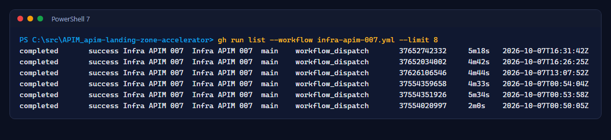
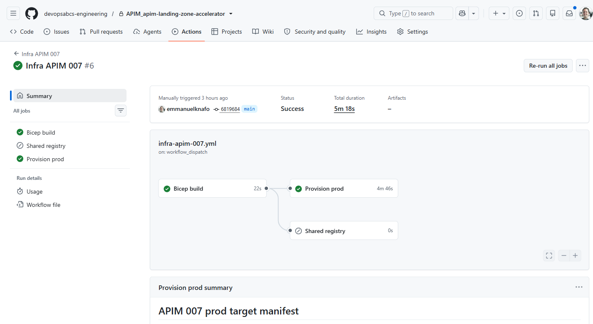
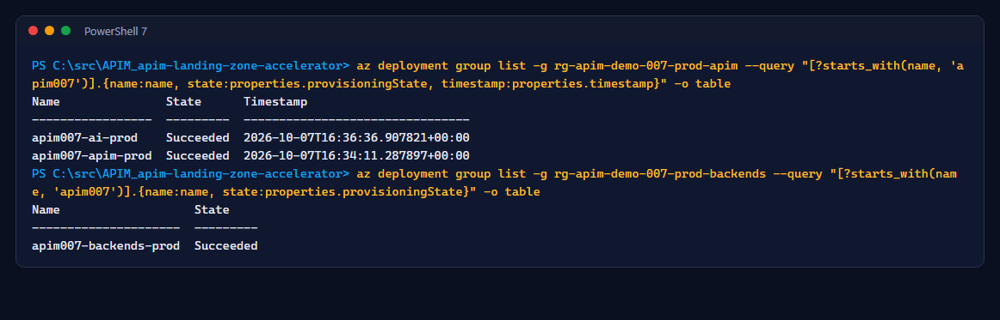
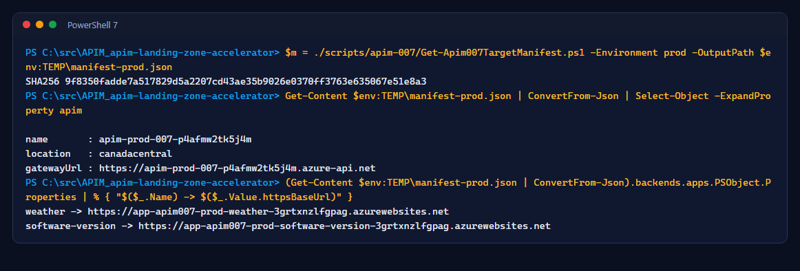

# Lab 1: Provision dev and prod with Bicep

<span class="chip phase-build"><span aria-hidden="true">🏗️</span> Infrastructure</span> <span class="chip phase-idea">40 min</span> <span class="chip phase-plan">Intermediate</span>

## Overview

<div class="lab-meta" markdown>

| Item | Details |
|------|---------|
| **Duration** | 40 minutes (API Management Basic v2 takes most of it) |
| **Level** | Intermediate |
| **Prerequisites** | [Lab 0](lab-00-setup.md) complete |
| **Checkpoint** | `apim007-apim-<env>` and `apim007-backends-<env>` succeeded in both environments; a target manifest for prod |
| **Next lab** | [Lab 2: The bundle](lab-02-bundle.md) |

</div>

Infrastructure and configuration have separate owners. `infra-apim-007.yml` provisions **hosting only**: it never publishes APIs and never switches an existing app's image. Releases own the configuration and the images.

## Learning objectives

By the end of this lab, you will be able to:

* Run the infra workflow for the shared, dev and prod targets.
* Explain why fresh backend apps start on an approved, digest-pinned bootstrap image.
* Derive a target manifest from fixed deployment names instead of guessing resource names.

## Steps

### Step 1: Approve the bootstrap image

New App Service apps start on a digest-pinned sample image until the first release. `infra/apim-demo-007/bootstrap-image.json` must record who approved it:

```json
{
    "image": "mcr.microsoft.com/dotnet/samples@sha256:4682284c8c2f87d426ff2ee27319705af02620e36e486b450ab080d9c83cbad9",
    "tag": "aspnetapp-8.0",
    "port": 8080,
    "approvedBy": "<your-github-login>",
    "approvedOn": "<yyyy-mm-dd>"
}
```

Commit it through a pull request. The validation workflow and the infra workflow both refuse `PENDING` values.

### Step 2: Deploy the shared registry, then finish setup

```powershell
gh workflow run infra-apim-007.yml --repo $Repo -f target=shared
gh run watch --repo $Repo (gh run list --repo $Repo --workflow infra-apim-007.yml --limit 1 --json databaseId --jq '.[0].databaseId')
```

The run summary prints the registry name. Grant the AcrPull-only role and publish the registry variables:

```powershell
./scripts/apim-007-setup/Initialize-Apim007Environment.ps1 -Stage PostRegistry `
    -SubscriptionId $SubscriptionId -TenantId $TenantId -GitHubRepository $Repo -RegistryName '<registryName>'
```

### Step 3: Provision dev, then prod

```powershell
gh workflow run infra-apim-007.yml --repo $Repo -f target=dev
gh workflow run infra-apim-007.yml --repo $Repo -f target=prod
gh run list --repo $Repo --workflow infra-apim-007.yml --limit 8
```

<figure class="screenshot-frame" markdown>

<figcaption>Infra runs in the recorded environment (the later ones also deploy the AI services of Lab 7).</figcaption>
</figure>

Each run checks the tenant and subscription, verifies the resource group tags, runs a Bicep what-if, deploys and prints a target manifest:

<figure class="screenshot-frame" markdown>

<figcaption>Run <code>37652742332</code>: provisioning prod-007.</figcaption>
</figure>

!!! warning "Basic v2 takes time"
    A new API Management Basic v2 service usually takes 15 to 40 minutes. The workflow waits; do not cancel it.

### Step 4: Check the fixed deployments

Every release finds its targets through **fixed deployment names**, not through searches:

```powershell
az deployment group list -g rg-apim-demo-007-prod-apim --query "[?starts_with(name, 'apim007')].{name:name, state:properties.provisioningState, timestamp:properties.timestamp}" -o table
az deployment group list -g rg-apim-demo-007-prod-backends --query "[?starts_with(name, 'apim007')].{name:name, state:properties.provisioningState}" -o table
```

<figure class="screenshot-frame" markdown>

<figcaption>The deployments <code>apim007-apim-prod</code>, <code>apim007-backends-prod</code> (and from Lab 7 <code>apim007-ai-prod</code>).</figcaption>
</figure>

### Step 5: Build the target manifest

The manifest is the contract between infrastructure and releases: exact resource IDs, the gateway URL and the backend URLs, validated against tags and resource groups.

```powershell
$env:EXPECTED_TENANT_ID = $TenantId; $env:EXPECTED_SUBSCRIPTION_ID = $SubscriptionId
$m = ./scripts/apim-007/Get-Apim007TargetManifest.ps1 -Environment prod -OutputPath $env:TEMP\manifest-prod.json
(Get-Content $env:TEMP\manifest-prod.json | ConvertFrom-Json).apim | Select-Object name, location, gatewayUrl
```

<figure class="screenshot-frame" markdown>

<figcaption>The prod target manifest. Its SHA256 is recorded in the prod plan and checked again before the prod deployment.</figcaption>
</figure>

!!! checkpoint "Checkpoint"
    Both environments show `Succeeded` deployments, both gateways answer on `https://<apim-name>.azure-api.net`, and the manifest script runs without errors for `dev` and `prod`.
