# Lab 2: The environment-neutral bundle

<span class="chip phase-plan"><span aria-hidden="true">📦</span> Bundle</span> <span class="chip phase-idea">30 min</span> <span class="chip phase-plan">Intermediate</span>

## Overview

<div class="lab-meta" markdown>

| Item | Details |
|------|---------|
| **Duration** | 30 minutes |
| **Level** | Intermediate |
| **Prerequisites** | [Lab 1](lab-01-infrastructure.md) complete |
| **Checkpoint** | Bundle check and Pester pass locally; dev and prod override files generated |
| **Next lab** | [Lab 3: First release](lab-03-baseline-release.md) |

</div>

The bundle contains **no environment values**. Service URLs, backend hosts and AI limits come from small override files that a script generates from the target manifest at release time.

<figure class="anim-frame" markdown>

<figcaption>One bundle, two generated override files.</figcaption>
</figure>

## Learning objectives

By the end of this lab, you will be able to:

* Read the APIops CLI native folder layout.
* Explain what the ownership filter protects.
* Generate override files and validate the bundle before you open a pull request.

## Steps

### Step 1: Explore the bundle

```powershell
Get-ChildItem artifacts.007 -Recurse -File | ForEach-Object { $_.FullName.Substring($PWD.Path.Length + 1) }
```

<figure class="screenshot-frame" markdown>

<figcaption>The pre-AI bundle: Weather (REST) and SoftwareVersion (SOAP) APIs, their backends, the <code>demo</code> product and one named value.</figcaption>
</figure>

| Folder | Holds |
|--------|-------|
| `apis/<name>/` | `apiInformation.json`, the specification (OpenAPI or WSDL), `policy.xml` |
| `backends/<name>/` | `backendInformation.json` with a sentinel URL replaced by overrides |
| `products/<name>/` | `productInformation.json`, `apis.json`, optional `policy.xml` |
| `namedValues/<name>/` | `namedValueInformation.json` |

### Step 2: Read the ownership filter

```powershell
Get-Content configuration.007.ownership.yaml
```

<figure class="screenshot-frame" markdown>

<figcaption>Every publish and extraction runs with <code>--filter</code> and <code>--no-transitive</code>: the pipeline only touches what it owns.</figcaption>
</figure>

!!! gate "Why a filter"
    The APIM service also holds things the pipeline must never change: the Application Insights logger, its instrumentation key, the release-state named value. They are outside the filter, and a fingerprint check fails the release if they change.

### Step 3: Validate the bundle and run the unit tests

```powershell
./scripts/apim-007/Test-Apim007Bundle.ps1 -BundlePath artifacts.007 -InventoryPath configuration.007.expected-inventory.json -Mode Candidate
Invoke-Pester -Path scripts/apim-007/tests -Output Minimal
```

<figure class="screenshot-frame" markdown>

<figcaption>The same checks run in the pull-request workflow and before every candidate freeze.</figcaption>
</figure>

### Step 4: Generate the prod overrides

```powershell
$o = ./scripts/apim-007/New-Apim007Overrides.ps1 -ManifestPath $env:TEMP\manifest-prod.json `
    -InventoryPath configuration.007.expected-inventory.json -OutputPath $env:TEMP\overrides-prod.json
$j = Get-Content $env:TEMP\overrides-prod.json | ConvertFrom-Json
$j.apis | ForEach-Object { "$($_.name) -> $($_.properties.serviceUrl)" }
```

<figure class="screenshot-frame" markdown>

<figcaption>Overrides for prod: each value is checked against a strict pattern, and the file hash is recorded in the plan.</figcaption>
</figure>

### Step 5: Open a pull request

Change something small (for example a policy header) on a branch, push it and open a pull request. `validate-apim-007.yml` runs without any Azure credentials:

<figure class="screenshot-frame" markdown>

<figcaption>Pull request #30 (the AI bundle) with all validation checks green.</figcaption>
</figure>

!!! checkpoint "Checkpoint"
    `Bundle validation passed`, Pester reports no failures, and `overrides-prod.json` lists prod URLs only.
