# Lab 3: First release - candidate, dev, approval, prod

<span class="chip phase-deploy"><span aria-hidden="true">🚀</span> Release</span> <span class="chip phase-idea">45 min</span> <span class="chip phase-plan">Intermediate</span>

## Overview

<div class="lab-meta" markdown>

| Item | Details |
|------|---------|
| **Duration** | 45 minutes (a full release takes about 25 minutes) |
| **Level** | Intermediate |
| **Prerequisites** | [Lab 2](lab-02-bundle.md) complete |
| **Checkpoint** | Both environments `clean` on the same candidate tag |
| **Next lab** | [Lab 4: A-to-B promotion](lab-04-promotion-a-to-b.md) |

</div>

A merge to `main` that touches the bundle, the configuration, the tooling or the release scripts starts `release-apiops-007.yml`. It builds **one** candidate and promotes it.

<figure class="anim-frame" markdown>

<figcaption>The release path. Prod never receives anything dev did not test.</figcaption>
</figure>

## Learning objectives

By the end of this lab, you will be able to:

* Follow the seven release jobs and say what each one guarantees.
* Find a candidate release and verify that it is immutable.
* Read the plan summary and approve a prod deployment from the GitHub UI or the CLI.
* Read the release state stored in each APIM service.

## Steps

### Step 1: Start the first release and watch it

On a fresh repository nothing has been merged yet, so start the first release by hand. It builds a candidate from the bundle on `main`, where every API returns `x-demo-release: baseline-a` (`baseline-ai` for the AI gateway). From Lab 4 on, merging a pull request starts the release for you.

```powershell
gh workflow run release-apiops-007.yml --repo $Repo --ref main
gh run list --repo $Repo --workflow release-apiops-007.yml --limit 14
```

<figure class="screenshot-frame" markdown>

<figcaption>Release history in the recorded run, including failures that were caught on purpose (Lab 6).</figcaption>
</figure>

<figure class="screenshot-frame" markdown>

<figcaption>The same history in GitHub.</figcaption>
</figure>

| Job | Guarantees |
|-----|------------|
| Build candidate | Images build, contracts match the committed specifications, bundle valid |
| Push images | Images pushed by digest with the push-only identity |
| Freeze candidate | `candidate.tar.gz` and its manifest published as an **immutable** prerelease |
| Resolve candidate | The exact tag and SHA256 every later job must use |
| Deploy dev-007 | Rollout, dry run, publish, extraction comparison, gateway tests, second publish |
| Plan prod-007 | Read-only: prod overrides, release-state gates, environment protection check |
| Deploy prod-007 | After approval: hashes re-checked, then the same steps as dev |

<figure class="screenshot-frame" markdown>

<figcaption>Run <code>37660072964</code>: candidate 18 through dev and prod.</figcaption>
</figure>

### Step 2: Inspect the frozen candidate

```powershell
gh release list --repo $Repo --limit 10
[long]$ReleaseRunId = Read-Host 'Run ID printed by the workflow dispatch in step 1'
$releaseRun = gh api "repos/$Repo/actions/runs/$ReleaseRunId" | ConvertFrom-Json
$BaselineTag = "apim007-candidate-$($releaseRun.run_number)-$($releaseRun.head_sha.Substring(0, 7))"
gh release view $BaselineTag --repo $Repo --json tagName,isImmutable,assets --jq '{tag: .tagName, immutable: .isImmutable, assets: [.assets[].name]}'
```

Keep `$ReleaseRunId` for this approval and save `$BaselineTag` for Lab 6. If the release asset is not available yet, wait for *Freeze candidate* to finish.

<figure class="screenshot-frame" markdown>

<figcaption>Candidates are immutable releases: their assets and tags can never change.</figcaption>
</figure>

<figure class="screenshot-frame" markdown>

<figcaption>Rollback (Lab 6) redeploys from these releases, not from workflow artifacts.</figcaption>
</figure>

### Step 3: Approve prod

When `Plan prod-007` succeeds, the run waits on the `prod-007` environment. Read the plan summary first: candidate, source commit, prod gateway, manifest and override hashes, images.

Approve in the GitHub UI (**Review deployments**), or from PowerShell:

```powershell
$pending = gh api "repos/$Repo/actions/runs/$ReleaseRunId/pending_deployments" | ConvertFrom-Json
$prod = @($pending | Where-Object { $_.environment.name -eq 'prod-007' })
if ($prod.Count -ne 1 -or -not $prod[0].current_user_can_approve) { throw 'Prod is not awaiting your review, or self-review is blocked.' }
@{ environment_ids = @([long]$prod[0].environment.id); state = 'approved'; comment = 'Plan reviewed' } |
    ConvertTo-Json -Compress | gh api -X POST "repos/$Repo/actions/runs/$ReleaseRunId/pending_deployments" --input -
```

For a solo lab, configure `-PreventSelfReview $false` in Lab 0 first. The API does not bypass required reviewers or the self-review rule.

<figure class="screenshot-frame" markdown>

<figcaption><code>prod-007</code>: required reviewer and a <code>main</code>-only branch policy. The plan job fails if this protection is weakened.</figcaption>
</figure>

```powershell
gh api repos/$Repo/actions/runs/37660072964/approvals --jq '.[] | {environment: .environments[0].name, state, user: .user.login, comment}'
```

<figure class="screenshot-frame" markdown>

<figcaption>Every approval or rejection is recorded with its comment.</figcaption>
</figure>

!!! human "A rejection is a valid outcome"
    In run `37658029033` the reviewer **rejected** prod: the candidate carried new scripts whose AI tests had nothing to test in prod yet. Prod stayed on its previous clean candidate. The fix shipped as a new candidate.

<figure class="screenshot-frame" markdown>

<figcaption>Run <code>37658029033</code>: dev passed, prod rejected by the reviewer.</figcaption>
</figure>

### Step 4: Read the release state

Each APIM service stores a non-secret named value `apim007-release-state` with the deployed candidate, its hash, the status and a history of clean candidates:

```powershell
$ProdApim = (Get-Content $env:TEMP/manifest-prod.json | ConvertFrom-Json).apim.name
az apim nv show -g rg-apim-demo-007-prod-apim -n $ProdApim --named-value-id apim007-release-state --query value -o tsv | ConvertFrom-Json
```

<figure class="screenshot-frame" markdown>

<figcaption>Status values: <code>deploying</code>, <code>clean</code> or <code>dirty</code>. Prod only accepts a candidate that is <code>clean</code> in dev.</figcaption>
</figure>

!!! checkpoint "Checkpoint"
    Dev and prod show `status: clean` with the same `candidateTag`, and both receipts (`receipt-dev-007`, `receipt-prod-007`) are attached to the run.
