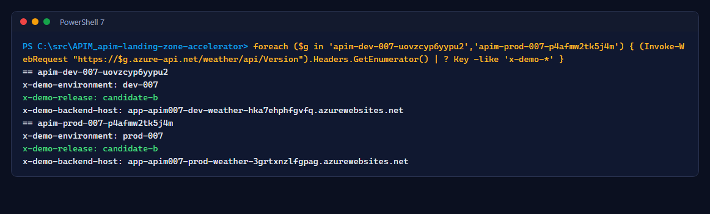
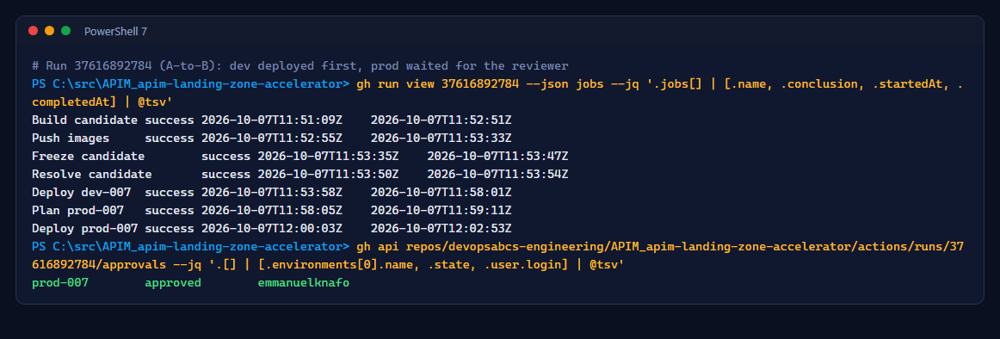

# Lab 4: A-to-B promotion

<span class="chip phase-sign"><span aria-hidden="true">🔀</span> Promotion</span> <span class="chip phase-idea">25 min</span> <span class="chip phase-plan">Intermediate</span>

## Overview

<div class="lab-meta" markdown>

| Item | Details |
|------|---------|
| **Duration** | 25 minutes |
| **Level** | Intermediate |
| **Prerequisites** | [Lab 3](lab-03-baseline-release.md) complete, both environments `clean` |
| **Checkpoint** | Both gateways return `x-demo-release: candidate-b` |
| **Next lab** | [Lab 5: Extraction GitOps](lab-05-extraction-gitops.md) |

</div>

This is the demo moment: the same change is visible in dev while prod still serves the previous release, until a human approves.

## Learning objectives

By the end of this lab, you will be able to:

* Make an observable configuration change through a pull request.
* Prove with response headers which release each environment serves.
* Show from the run history that prod waited for the reviewer.

## Steps

### Step 1: Check the current release headers

Every API policy sets three response headers: `x-demo-environment`, `x-demo-release` and `x-demo-backend-host`.

```powershell
$env:EXPECTED_TENANT_ID = $TenantId
$env:EXPECTED_SUBSCRIPTION_ID = $SubscriptionId
$null = ./scripts/apim-007/Get-Apim007TargetManifest.ps1 -Environment dev -OutputPath $env:TEMP/manifest-dev.json
$Gateways = (Get-Content $env:TEMP/manifest-dev.json | ConvertFrom-Json).apim.name,
    (Get-Content $env:TEMP/manifest-prod.json | ConvertFrom-Json).apim.name
foreach ($g in $Gateways) {
    "== $g"
    (Invoke-WebRequest "https://$g.azure-api.net/weather/api/Version" -SkipHttpErrorCheck).Headers.GetEnumerator() |
        Where-Object Key -like 'x-demo-*' | ForEach-Object { "$($_.Key): $($_.Value)" }
}
```

<figure class="screenshot-frame" markdown>

<figcaption>Each environment reports its own name and its own backend host, and the same release value.</figcaption>
</figure>

### Step 2: Change A to B through a pull request

Use the numeric ID of your actual ADO User Story or Bug. For example, ID `1234` produces `feature/1234-candidate-b`; do not type angle-bracket placeholders. Start with a clean worktree. Stop immediately if a Git command fails.

```powershell
[int]$WorkItemId = Read-Host 'ADO User Story or Bug ID'
if ($WorkItemId -le 0) { throw 'A real work item ID is required.' }
if (git status --porcelain) { throw 'Commit or preserve your existing changes first.' }
git switch main
if ($LASTEXITCODE) { throw 'Could not switch to main.' }
git pull --ff-only
if ($LASTEXITCODE) { throw 'Could not update main.' }
$Branch = "feature/$WorkItemId-candidate-b"
git switch -c $Branch
if ($LASTEXITCODE) { throw 'Branch creation failed; do not continue on main.' }
foreach ($p in 'artifacts.007/apis/weather/policy.xml', 'artifacts.007/apis/software-version/policy.xml') {
    $policy = Get-Content $p -Raw
    if (-not $policy.Contains('<value>baseline-a</value>')) { throw "No baseline-a in $p; inspect the starting state." }
    $policy.Replace('<value>baseline-a</value>', '<value>candidate-b</value>') | Set-Content $p -NoNewline
}
git add -- artifacts.007/apis/weather/policy.xml artifacts.007/apis/software-version/policy.xml
git commit -m "feat: promote candidate-b AB#$WorkItemId"
if ($LASTEXITCODE) { throw 'Commit failed.' }
git push -u origin $Branch
if ($LASTEXITCODE) { throw 'Push failed.' }
gh pr create --repo $Repo --base main --head $Branch --fill
```

Merge the pull request when the checks pass. The release starts automatically.

### Step 3: Show dev ahead of prod

While `Deploy prod-007` waits for approval, run the header loop from step 1 again.

!!! success "Expected result"
    Dev returns `x-demo-release: candidate-b`. Prod still returns `baseline-a`.

### Step 4: Approve and show prod catch up

Approve `prod-007` (Lab 3, step 3), wait for the run to finish, and run the header loop again: both return `candidate-b`.

```powershell
gh run view 37616892784 --repo $Repo --json jobs --jq '.jobs[] | [.name, .conclusion, .startedAt, .completedAt] | @tsv'
gh api repos/$Repo/actions/runs/37616892784/approvals --jq '.[] | [.environments[0].name, .state, .user.login] | @tsv'
```

<figure class="screenshot-frame" markdown>

<figcaption>Run <code>37616892784</code>: dev was done long before prod started, and prod started only after the approval.</figcaption>
</figure>

!!! checkpoint "Checkpoint"
    Both gateways return `candidate-b`, and both release states record the new candidate as `clean`.
