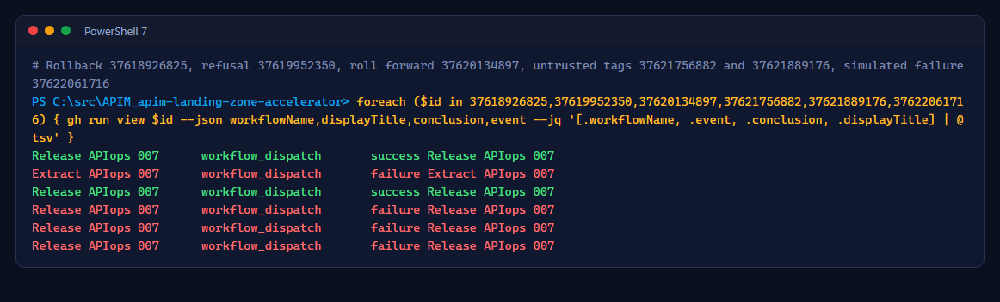
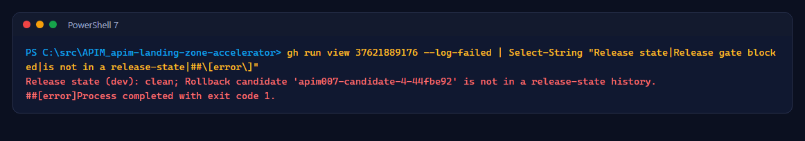

# Lab 6: Rollback, roll forward and failure tests

<span class="chip phase-test"><span aria-hidden="true">⏪</span> Rollback</span> <span class="chip phase-idea">35 min</span> <span class="chip phase-plan">Advanced</span>

## Overview

<div class="lab-meta" markdown>

| Item | Details |
|------|---------|
| **Duration** | 35 minutes |
| **Level** | Advanced |
| **Prerequisites** | [Lab 5](lab-05-extraction-gitops.md) complete, at least two clean candidates in the history |
| **Checkpoint** | Both environments back on the `main` candidate after a rollback and a roll forward |
| **Next lab** | [Lab 7: AI infrastructure](lab-07-ai-infrastructure.md) |

</div>

Rollback is a normal release of an older candidate: same tests, same approval. Only candidates recorded as `clean` in the dev or prod history are trusted; a release asset alone is never enough.

## Learning objectives

By the end of this lab, you will be able to:

* Roll back both environments to a previous candidate tag.
* Roll forward by releasing `main` again.
* Show that an unknown or untrusted tag and a failing dev gate never reach prod.

## Steps

### Step 1: Roll back to the baseline candidate

Use `$BaselineTag` saved from your own Lab 3 release, not the historical tag shown in the screenshots. Old releases are not trusted after a full Azure reset because their release-state history is gone.

```powershell
if (-not $BaselineTag) { throw 'Set BaselineTag to the tag saved in Lab 3.' }
gh workflow run release-apiops-007.yml --repo $Repo -f "rollback_candidate_tag=$BaselineTag"
```

The build, push and freeze jobs are skipped. `Deploy dev-007` checks that the tag and its SHA256 appear in a release-state history, then deploys. Approve prod as usual. Both gateways return `baseline-a` again.

### Step 2: Roll forward

```powershell
gh workflow run release-apiops-007.yml --repo $Repo
```

A run from `main` without inputs builds a new candidate from the current bundle. Approve prod; both gateways return `candidate-b`.

### Step 3: Try an untrusted tag

```powershell
gh workflow run release-apiops-007.yml --repo $Repo -f rollback_candidate_tag=apim007-candidate-999-0000000
```

!!! success "Expected result"
    A nonexistent tag fails in `Resolve candidate`, before any deployment. An existing release whose tag/hash is absent from the fresh trusted history fails in `Deploy dev-007` at the trusted-hash step. Both refusals happen before marking anything as deploying, and prod is skipped. Keep the failure run ID for your evidence.

### Step 4: Simulate a failing dev gate

```powershell
gh workflow run release-apiops-007.yml --repo $Repo -f simulate_dev_gate_failure=true
```

The dev gateway test expects a release value the candidate does not set, so dev fails after publishing: the dev state becomes `dirty`, and `Plan prod-007` and `Deploy prod-007` are skipped. Reconcile with a normal release from `main`.

### Step 5: Review the evidence

```powershell
foreach ($id in 37618926825, 37619952350, 37620134897, 37621756882, 37621889176, 37622061716) {
    gh run view $id --repo $Repo --json workflowName,displayTitle,conclusion,event --jq '[.workflowName, .event, .conclusion, .displayTitle] | @tsv'
}
```

<figure class="screenshot-frame" markdown>

<figcaption>Green where it should pass, red where it must stop.</figcaption>
</figure>

```powershell
gh run view 37621889176 --repo $Repo --log-failed | Select-String "history"
```

<figure class="screenshot-frame" markdown>

<figcaption>A well-formed tag that is not in either history is refused before any write.</figcaption>
</figure>

!!! loop "Rollback is not an atomic restore"
    Rollback republishes an older bundle with full tests. It does not delete resources that a later candidate added (for example an extra API). Remove those through a pull request.

!!! checkpoint "Checkpoint"
    Both environments `clean` on the `main` candidate, and the failure runs show red where expected.
