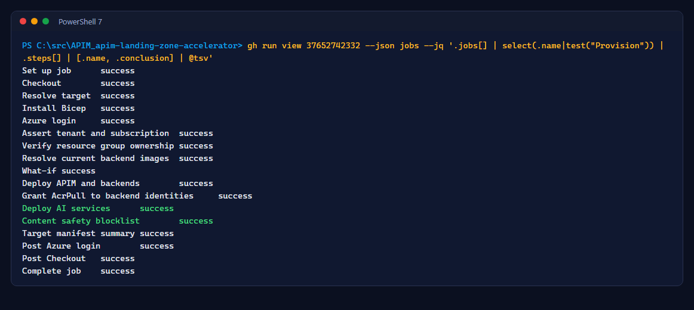
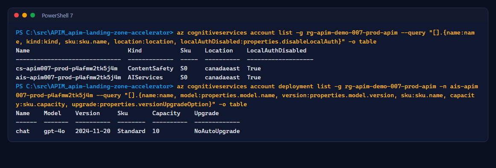
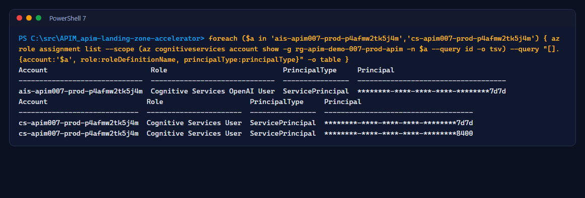

# Lab 7: AI gateway infrastructure

<span class="chip phase-build"><span aria-hidden="true">🤖</span> AI infrastructure</span> <span class="chip phase-idea">30 min</span> <span class="chip phase-plan">Advanced</span>

## Overview

<div class="lab-meta" markdown>

| Item | Details |
|------|---------|
| **Duration** | 30 minutes |
| **Level** | Advanced |
| **Prerequisites** | [Lab 6](lab-06-rollback.md) complete; quota for `gpt-4o` Standard in `canadaeast` (or change the region and model in the parameter files) |
| **Checkpoint** | `apim007-ai-<env>` succeeded in both environments; the blocklist exists |
| **Next lab** | [Lab 8: AI release](lab-08-ai-release.md) |

</div>

The AI gateway puts API Management in front of Azure OpenAI. Clients never see a model key: APIM calls the model with its **managed identity**, and both AI accounts have local (key) authentication disabled.

<figure class="anim-frame" markdown>

<figcaption>The request path you will build in Labs 7 to 9.</figcaption>
</figure>

## Learning objectives

By the end of this lab, you will be able to:

* Deploy the AI accounts per environment next to the APIM service.
* Explain which identity gets which data role, and why the infra identity is allowed to grant only those roles.
* Create the content safety blocklist used by the tests.

## Steps

### Step 1: Allow the infra identity to grant the AI data roles

The AI Bicep grants the APIM managed identity two data roles. The infra identity's RBAC Administrator condition must allow them. Re-run the setup once (it updates the condition in place):

```powershell
./scripts/apim-007-setup/Initialize-Apim007Environment.ps1 -Stage Initial `
    -SubscriptionId $SubscriptionId -TenantId $TenantId -Location $Location `
    -GitHubRepository $Repo -BudgetAmount 150 -BudgetAlertEmail '<you@example.com>' `
    -ExpiresOn (Get-Date).AddDays(30).ToString('yyyy-MM-dd') -ProdReviewers $Reviewer -WhatIf
```

Review the two *Update role assignment condition* lines, then run it again without `-WhatIf`.

### Step 2: Review the AI Bicep

| File | Defines |
|------|---------|
| `infra/apim-demo-007/ai.bicep` | AIServices account and deployment `chat`, ContentSafety account, role assignments |
| `ai.parameters.dev.json`, `ai.parameters.prod.json` | Model `gpt-4o` `2024-11-20`, Standard, capacity 10 |
| `configuration.007.ai-settings.json` | Blocklist name and fixture term, per-team limits, safety threshold |

| Principal | Role | On |
|-----------|------|----|
| APIM system identity | Cognitive Services OpenAI User | AIServices account |
| APIM system identity | Cognitive Services User | ContentSafety account |
| Infra identity | Cognitive Services User | ContentSafety account (blocklist writer) |

### Step 3: Run the infra workflow

```powershell
gh workflow run infra-apim-007.yml --repo $Repo -f target=dev
gh workflow run infra-apim-007.yml --repo $Repo -f target=prod
```

The provision job now deploys `apim007-ai-<env>` after APIM and writes the blocklist:

```powershell
gh run view <run-id> --repo $Repo --json jobs --jq '.jobs[] | select(.name|test("Provision")) | .steps[] | [.name, .conclusion] | @tsv'
```

<figure class="screenshot-frame" markdown>

<figcaption>Run <code>37652742332</code>: AI services and the blocklist deployed by the prod infra identity.</figcaption>
</figure>

### Step 4: Verify the accounts, the model and the roles

```powershell
az cognitiveservices account list -g rg-apim-demo-007-prod-apim --query "[].{name:name, kind:kind, sku:sku.name, location:location, localAuthDisabled:properties.disableLocalAuth}" -o table
az cognitiveservices account deployment list -g rg-apim-demo-007-prod-apim -n <ais-account-name> --query "[].{name:name, model:properties.model.name, version:properties.model.version, sku:sku.name, capacity:sku.capacity}" -o table
```

<figure class="screenshot-frame" markdown>

<figcaption>Both accounts have <code>disableLocalAuth</code> set: keys cannot be used at all.</figcaption>
</figure>

```powershell
foreach ($a in '<ais-account-name>', '<cs-account-name>') {
    $id = az cognitiveservices account show -g rg-apim-demo-007-prod-apim -n $a --query id -o tsv
    az role assignment list --scope $id --query "[].{account:'$a', role:roleDefinitionName, principalType:principalType}" -o table
}
```

<figure class="screenshot-frame" markdown>

<figcaption>Only service principals hold data roles; no user has standing access.</figcaption>
</figure>

!!! checkpoint "Checkpoint"
    Both environments have two AI accounts with local auth disabled, a `chat` deployment, and the infra run shows `Content safety blocklist` succeeded.
