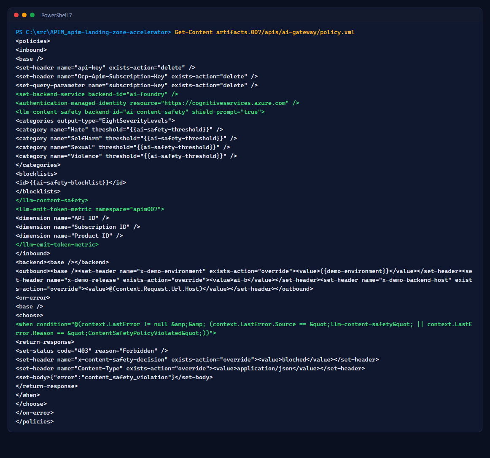
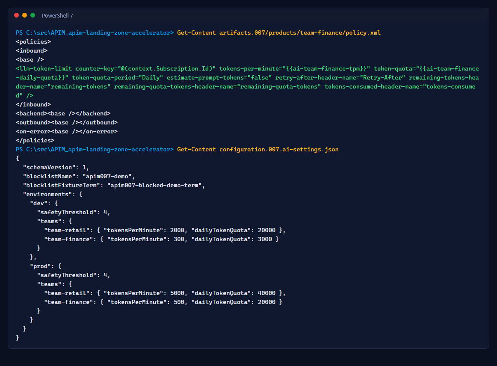
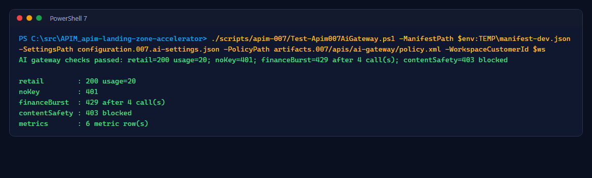

# Lab 8: AI gateway release and tests

<span class="chip phase-deploy"><span aria-hidden="true">🧠</span> AI release</span> <span class="chip phase-idea">35 min</span> <span class="chip phase-plan">Advanced</span>

## Overview

<div class="lab-meta" markdown>

| Item | Details |
|------|---------|
| **Duration** | 35 minutes |
| **Level** | Advanced |
| **Prerequisites** | [Lab 7](lab-07-ai-infrastructure.md) complete |
| **Checkpoint** | A release where `AI gateway subscriptions and tests` passed in dev and prod |
| **Next lab** | [Lab 9: AI promotion and showback](lab-09-ai-promotion-showback.md) |

</div>

The AI gateway is just more bundle: one API, two backends, two products and six named values. The release workflow adds one step that creates the team subscriptions and runs five tests.

## Learning objectives

By the end of this lab, you will be able to:

* Read the AI API policy and the team product policies.
* Explain why limits and thresholds live in named values filled by overrides.
* Read the five AI tests and what each one proves.

## Steps

### Step 1: Read the AI API policy

```powershell
Get-Content artifacts.007/apis/ai-gateway/policy.xml
```

<figure class="screenshot-frame" markdown>

<figcaption>Inbound: remove the client key, route to the model with managed identity, screen with Content Safety, emit token metrics.</figcaption>
</figure>

| Policy | Role |
|--------|------|
| `set-header ... delete` | The team key never reaches the model |
| `set-backend-service` + `authentication-managed-identity` | Keyless call to Azure OpenAI |
| `llm-content-safety` | Prompt shields, four harm categories at `{{ai-safety-threshold}}`, blocklist `{{ai-safety-blocklist}}` |
| `llm-emit-token-metric` | Prompt, completion and total tokens with API, subscription and product dimensions |
| `on-error` | A content safety block returns `403` with `x-content-safety-decision: blocked` |

!!! note "The client sends api-version"
    The policy does not set `api-version`: the APIops CLI extractor redacts literal values of `set-query-parameter`, which would break the extraction comparison. Clients pass it in the query string.

### Step 2: Read the team products and settings

```powershell
Get-Content artifacts.007/products/team-finance/policy.xml
Get-Content configuration.007.ai-settings.json
```

<figure class="screenshot-frame" markdown>

<figcaption>Each team product limits tokens per minute and per day, per subscription. The numbers come from the settings file, per environment.</figcaption>
</figure>

### Step 3: Release it

Merge the bundle pull request. The release runs as in [Lab 3](lab-03-baseline-release.md), with one more step in each deploy job:

1. `Set-Apim007TeamSubscriptions.ps1` creates `sub-team-retail` and `sub-team-finance`, scoped to their products. Subscriptions are never stored in the bundle.
2. `Test-Apim007AiGateway.ps1` reads the keys through ARM, masks them, and runs the tests.

!!! gate "The step runs only for AI candidates"
    The step checks that the candidate's inventory declares `aiSettings`. A candidate without the AI bundle (for example a rollback) skips it. This guard was added after the rejected run in [Lab 3](lab-03-baseline-release.md#step-3-approve-prod).

### Step 4: Read the five tests

```powershell
./scripts/apim-007/Test-Apim007AiGateway.ps1 -ManifestPath $env:TEMP\manifest-dev.json -SettingsPath configuration.007.ai-settings.json `
    -PolicyPath artifacts.007/apis/ai-gateway/policy.xml -WorkspaceCustomerId <log-analytics-workspace-id>
```

<figure class="screenshot-frame" markdown>

<figcaption>The same script runs in the pipeline, in dev and then in prod.</figcaption>
</figure>

| Test | Expects | Proves |
|------|---------|--------|
| T1 | No key → `401` | The API requires a team subscription |
| T2 | Retail → `200`, token usage, `remaining-tokens` | Managed identity call works and the limit policy runs |
| T3 | Finance burst → `429` with `Retry-After` | Per-team token limits are enforced |
| T4 | Blocklist term → `403 blocked` | Content Safety screens prompts before the model |
| T5 | Token metric rows in `AppMetrics` | Showback data arrives (warning only, ingestion can lag) |

!!! checkpoint "Checkpoint"
    The release run shows `AI gateway subscriptions and tests` green in `Deploy dev-007` and `Deploy prod-007` (recorded run `37660072964`).
