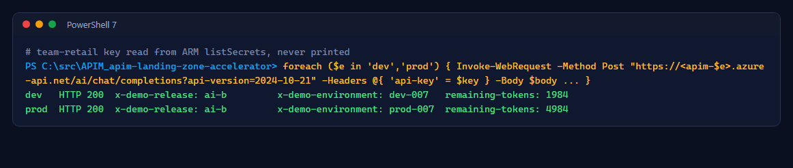
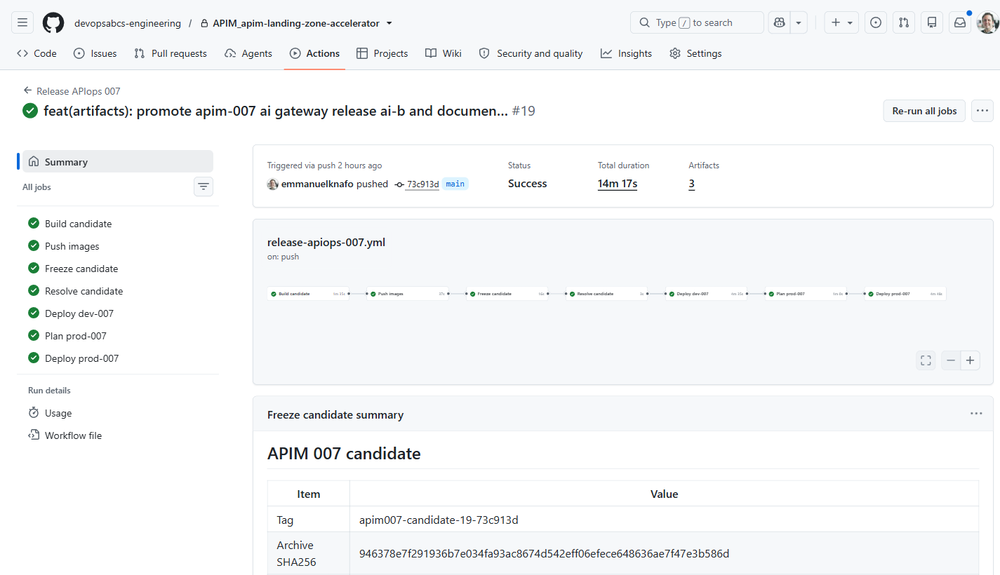
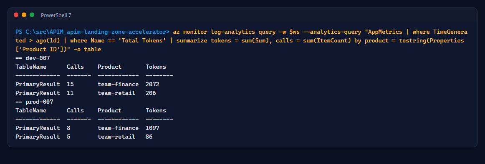

# Lab 9: AI promotion and token showback

<span class="chip phase-sign"><span aria-hidden="true">📊</span> AI promotion</span> <span class="chip phase-idea">25 min</span> <span class="chip phase-plan">Advanced</span>

## Overview

<div class="lab-meta" markdown>

| Item | Details |
|------|---------|
| **Duration** | 25 minutes |
| **Level** | Advanced |
| **Prerequisites** | [Lab 8](lab-08-ai-release.md) complete |
| **Checkpoint** | Both environments return `x-demo-release: ai-b`; a token report per team |
| **Next lab** | [Lab 10: Teardown](lab-10-teardown.md) |

</div>

AI configuration promotes like any other configuration. Here a policy change and a **prod-only** quota change travel together: the approver sees the new prod limit in the plan before approving.

## Learning objectives

By the end of this lab, you will be able to:

* Change an AI policy and a per-environment limit in one pull request.
* Prove with a real model call which release each environment serves.
* Report token use per team for showback or chargeback.

## Steps

### Step 1: Change the release header and a prod quota

Use your actual numeric work item ID. Stop immediately if branch creation fails; never continue with these edits on `main`.

```powershell
[int]$WorkItemId = Read-Host 'ADO User Story or Bug ID'
if ($WorkItemId -le 0) { throw 'A real work item ID is required.' }
if (git status --porcelain) { throw 'Commit or preserve your existing changes first.' }
git switch main
if ($LASTEXITCODE) { throw 'Could not switch to main.' }
git pull --ff-only
if ($LASTEXITCODE) { throw 'Could not update main.' }
$Branch = "feature/$WorkItemId-ai-b"
git switch -c $Branch
if ($LASTEXITCODE) { throw 'Branch creation failed; do not continue on main.' }
$p = 'artifacts.007/apis/ai-gateway/policy.xml'
$policy = Get-Content $p -Raw
if (-not $policy.Contains('<value>baseline-ai</value>')) { throw 'No baseline-ai marker; inspect the starting state.' }
$policy.Replace('<value>baseline-ai</value>', '<value>ai-b</value>') | Set-Content $p -NoNewline
$s = 'configuration.007.ai-settings.json'
$j = Get-Content $s -Raw | ConvertFrom-Json
$j.environments.prod.teams.'team-retail'.dailyTokenQuota = 40000
$j | ConvertTo-Json -Depth 6 | Set-Content $s
git add -- artifacts.007/apis/ai-gateway/policy.xml configuration.007.ai-settings.json
git commit -m "feat: promote ai-b and lower the prod retail quota AB#$WorkItemId"
if ($LASTEXITCODE) { throw 'Commit failed.' }
git push -u origin $Branch
if ($LASTEXITCODE) { throw 'Push failed.' }
gh pr create --repo $Repo --base main --head $Branch --fill
```

Merge after validation. The `Plan prod-007` summary lists the chat model, the safety threshold and each team's prod limits, including the new `40000`.

### Step 2: Call both gateways while prod waits

The probe reads the `team-retail` key through ARM and never prints it:

```powershell
$targets = @{
    dev = @('rg-apim-demo-007-dev-apim', (Get-Content $env:TEMP/manifest-dev.json | ConvertFrom-Json).apim.name)
    prod = @('rg-apim-demo-007-prod-apim', (Get-Content $env:TEMP/manifest-prod.json | ConvertFrom-Json).apim.name)
}
foreach ($e in 'dev', 'prod') {
    $rg, $name = $targets[$e]
    $id  = az apim show -g $rg -n $name --query id -o tsv
    $key = (az rest --method post --url "https://management.azure.com$id/subscriptions/sub-team-retail/listSecrets?api-version=2024-06-01-preview" | ConvertFrom-Json).primaryKey
    $r = Invoke-WebRequest -Method Post -Uri "https://$name.azure-api.net/ai/chat/completions?api-version=2024-10-21" `
        -Headers @{ 'api-key' = $key } -ContentType 'application/json' `
        -Body '{"messages":[{"role":"user","content":"Say hi in two words."}],"max_tokens":8}' -SkipHttpErrorCheck
    Remove-Variable key
    "{0,-5} HTTP {1} x-demo-release: {2} remaining-tokens: {3}" -f $e, $r.StatusCode, $r.Headers['x-demo-release'], $r.Headers['remaining-tokens']
}
```

!!! success "Expected result while prod waits"
    Dev returns `ai-b`; prod still returns `baseline-ai`. In the recorded run: `dev: HTTP 200 release=ai-b`, `prod: HTTP 200 release=baseline-ai`.

### Step 3: Approve and verify

Approve `prod-007`, wait for the run, and call both gateways again:

<figure class="screenshot-frame" markdown>

<figcaption>After approval both environments serve <code>ai-b</code>, each with its own remaining-token budget.</figcaption>
</figure>

<figure class="screenshot-frame" markdown>

<figcaption>Run <code>37663312626</code>: the <code>ai-b</code> promotion.</figcaption>
</figure>

### Step 4: Report token use per team

```powershell
$ai = az deployment group show -g rg-apim-demo-007-prod-apim -n apim007-apim-prod --query properties.outputs.applicationInsightsId.value -o tsv
$ws = az monitor log-analytics workspace show --ids (az resource show --ids $ai --query properties.WorkspaceResourceId -o tsv) --query customerId -o tsv
az monitor log-analytics query -w $ws -o table --analytics-query "AppMetrics | where TimeGenerated > ago(1d) | where Name == 'Total Tokens' | summarize tokens = sum(Sum), calls = sum(ItemCount) by product = tostring(Properties['Product ID'])"
```

<figure class="screenshot-frame" markdown>

<figcaption>Token showback per team product, straight from the metrics APIM emits.</figcaption>
</figure>

!!! tip "Query App Insights through the workspace"
    Workspace-based Application Insights stores metrics in the `AppMetrics` table of Log Analytics. Query the workspace, not `az monitor app-insights query`, which can return nothing for workspace-based components.

!!! checkpoint "Checkpoint"
    Both environments return `ai-b`, prod's retail daily quota is `40000`, and the showback query returns rows for both teams.
