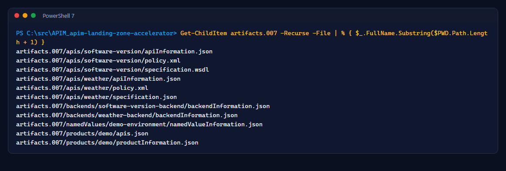
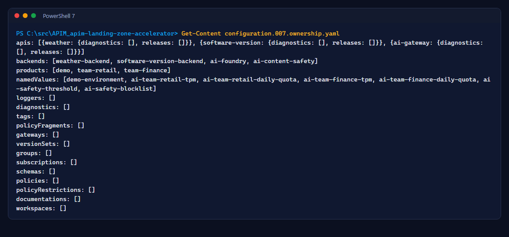
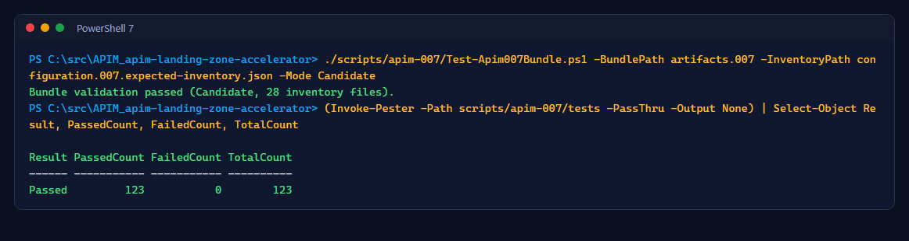
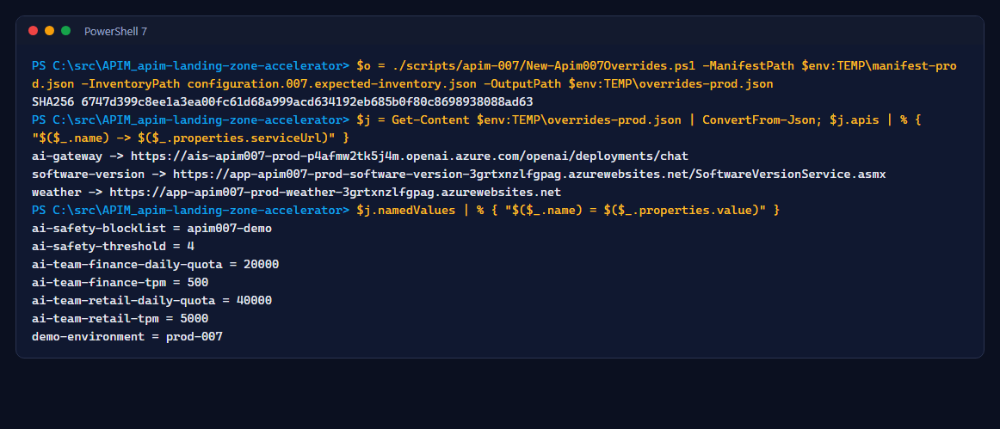
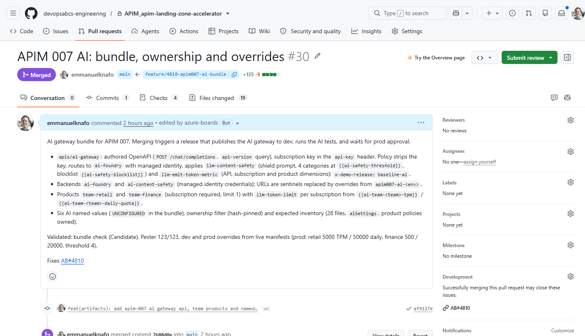

# Atelier 2 : Le paquet neutre

<span class="chip phase-plan"><span aria-hidden="true">📦</span> Paquet</span> <span class="chip phase-idea">30 min</span> <span class="chip phase-plan">Intermédiaire</span>

## Aperçu

<div class="lab-meta" markdown>

| Élément | Détails |
|------|---------|
| **Durée** | 30 minutes |
| **Niveau** | Intermédiaire |
| **Prérequis** | [Atelier 1](lab-01-infrastructure.md) terminé |
| **Point de contrôle** | Vérification du paquet et Pester réussis localement; fichiers de substitution dev et prod générés |
| **Atelier suivant** | [Atelier 3 : Première version](lab-03-baseline-release.md) |

</div>

Le paquet ne contient **aucune valeur d'environnement**. Les URL de service, les hôtes des backends et les limites IA viennent de petits fichiers de substitution qu'un script génère à partir du manifeste cible au moment de la publication.

<figure class="anim-frame" markdown>

<figcaption>Un seul paquet, deux fichiers de substitution générés.</figcaption>
</figure>

## Objectifs d'apprentissage

À la fin de cet atelier, vous saurez :

* Lire la structure de dossiers native de l'APIops CLI.
* Expliquer ce que protège le filtre de propriété.
* Générer les fichiers de substitution et valider le paquet avant d'ouvrir une demande de tirage.

## Étapes

### Étape 1 : Explorer le paquet

```powershell
Get-ChildItem artifacts.007 -Recurse -File | ForEach-Object { $_.FullName.Substring($PWD.Path.Length + 1) }
```

<figure class="screenshot-frame" markdown>

<figcaption>Le paquet avant l'IA : les API Weather (REST) et SoftwareVersion (SOAP), leurs backends, le produit <code>demo</code> et une valeur nommée.</figcaption>
</figure>

| Dossier | Contient |
|--------|-------|
| `apis/<name>/` | `apiInformation.json`, la spécification (OpenAPI ou WSDL), `policy.xml` |
| `backends/<name>/` | `backendInformation.json` avec une URL sentinelle remplacée par les substitutions |
| `products/<name>/` | `productInformation.json`, `apis.json`, `policy.xml` facultatif |
| `namedValues/<name>/` | `namedValueInformation.json` |

### Étape 2 : Lire le filtre de propriété

```powershell
Get-Content configuration.007.ownership.yaml
```

<figure class="screenshot-frame" markdown>

<figcaption>Chaque publication et chaque extraction s'exécutent avec <code>--filter</code> et <code>--no-transitive</code> : le pipeline ne touche que ce qu'il possède.</figcaption>
</figure>

!!! gate "Pourquoi un filtre"
    Le service APIM contient aussi des éléments que le pipeline ne doit jamais modifier : l'enregistreur Application Insights, sa clé d'instrumentation, la valeur nommée de l'état de version. Ils sont hors du filtre, et une vérification d'empreinte fait échouer la version s'ils changent.

### Étape 3 : Valider le paquet et exécuter les tests unitaires

```powershell
./scripts/apim-007/Test-Apim007Bundle.ps1 -BundlePath artifacts.007 -InventoryPath configuration.007.expected-inventory.json -Mode Candidate
Invoke-Pester -Path scripts/apim-007/tests -Output Minimal
```

<figure class="screenshot-frame" markdown>

<figcaption>Les mêmes vérifications s'exécutent dans le workflow de demande de tirage et avant chaque gel de candidat.</figcaption>
</figure>

### Étape 4 : Générer les substitutions de prod

```powershell
$o = ./scripts/apim-007/New-Apim007Overrides.ps1 -ManifestPath $env:TEMP\manifest-prod.json `
    -InventoryPath configuration.007.expected-inventory.json -OutputPath $env:TEMP\overrides-prod.json
$j = Get-Content $env:TEMP\overrides-prod.json | ConvertFrom-Json
$j.apis | ForEach-Object { "$($_.name) -> $($_.properties.serviceUrl)" }
```

<figure class="screenshot-frame" markdown>

<figcaption>Substitutions pour la prod : chaque valeur est vérifiée selon un motif strict, et le condensé du fichier est consigné dans le plan.</figcaption>
</figure>

### Étape 5 : Ouvrir une demande de tirage d'essai

Cette demande de tirage sert seulement à voir les vérifications : vous la fermez sans la fusionner. Une fusion dans `main` qui touche `artifacts.007/` lance une version, et la première version, c'est l'atelier 3.

L'exemple ajoute un en-tête de réponse, `x-demo-lab: lab-2`, à l'API Weather :

| Élément | Exemple |
|---------|---------|
| Branche | `feature/1234-lab2-weather-header` (remplacez `1234` par l'ID de votre élément de travail) |
| Fichier | `artifacts.007/apis/weather/policy.xml` |
| Changement | Un `set-header` dans `<outbound>`, juste avant l'en-tête `x-demo-backend-host` |

L'élément à ajouter :

```xml
<set-header name="x-demo-lab" exists-action="override"><value>lab-2</value></set-header>
```

Créez la branche et faites la modification (à la main dans VS Code, ou avec ces commandes) :

Saisissez l'ID numérique de votre véritable élément de travail. Le `1234` ci-dessus est un exemple, pas un ID à réutiliser. Si la création de branche échoue, arrêtez; ne validez pas sur `main`.

```powershell
[int]$WorkItemId = Read-Host 'ADO User Story or Bug ID'
if ($WorkItemId -le 0) { throw 'A real work item ID is required.' }
if (git status --porcelain) { throw 'Commit or preserve your existing changes first.' }
git switch main
if ($LASTEXITCODE) { throw 'Could not switch to main.' }
git pull --ff-only
if ($LASTEXITCODE) { throw 'Could not update main.' }
$Branch = "feature/$WorkItemId-lab2-weather-header"
git switch -c $Branch
if ($LASTEXITCODE) { throw 'Branch creation failed; do not continue on main.' }
$p = 'artifacts.007/apis/weather/policy.xml'
(Get-Content $p -Raw).Replace('<set-header name="x-demo-backend-host"',
    '<set-header name="x-demo-lab" exists-action="override"><value>lab-2</value></set-header><set-header name="x-demo-backend-host"') |
    Set-Content $p -NoNewline
git diff
```

La stratégie garde chaque section sur une ligne : `git diff` montre donc une seule ligne `<outbound>` modifiée. Vérifiez le paquet localement, puis validez, poussez et ouvrez la demande de tirage :

```powershell
./scripts/apim-007/Test-Apim007Bundle.ps1 -BundlePath artifacts.007 -InventoryPath configuration.007.expected-inventory.json -Mode Candidate
git add -- artifacts.007/apis/weather/policy.xml
git commit -m "chore: practice x-demo-lab header AB#$WorkItemId"
if ($LASTEXITCODE) { throw 'Commit failed.' }
git push -u origin $Branch
if ($LASTEXITCODE) { throw 'Push failed.' }
gh pr create --repo $Repo --base main --head $Branch --title "Lab 2: practice x-demo-lab header" --body "Practice pull request for Lab 2. Do not merge."
gh pr checks $Branch --repo $Repo --watch
```

`validate-apim-007.yml` s'exécute sans aucun identifiant Azure :

<figure class="screenshot-frame" markdown>

<figcaption>La demande de tirage n° 30 (le paquet IA) avec toutes les vérifications au vert.</figcaption>
</figure>

Quand toutes les vérifications réussissent, fermez la demande de tirage sans la fusionner. Cela supprime aussi la branche :

```powershell
gh pr close $Branch --repo $Repo --delete-branch
git switch main
```

!!! checkpoint "Point de contrôle"
    `Bundle validation passed`, Pester ne signale aucun échec, `overrides-prod.json` ne liste que des URL de prod, et la demande de tirage d'essai a montré des vérifications au vert et est fermée sans fusion.
