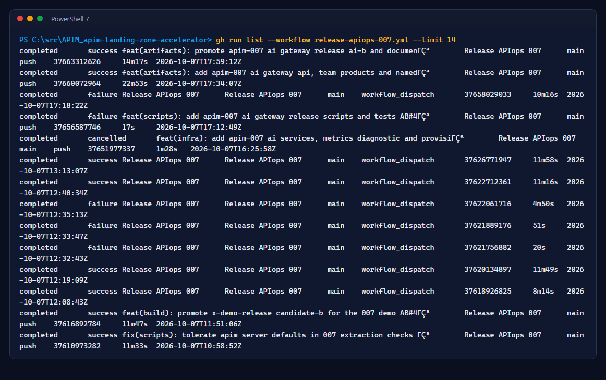
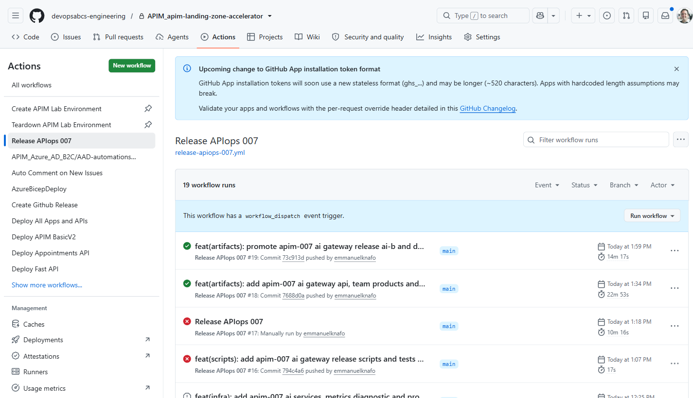
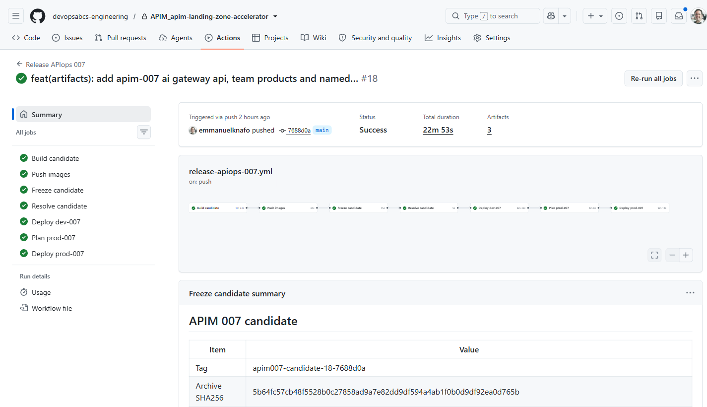
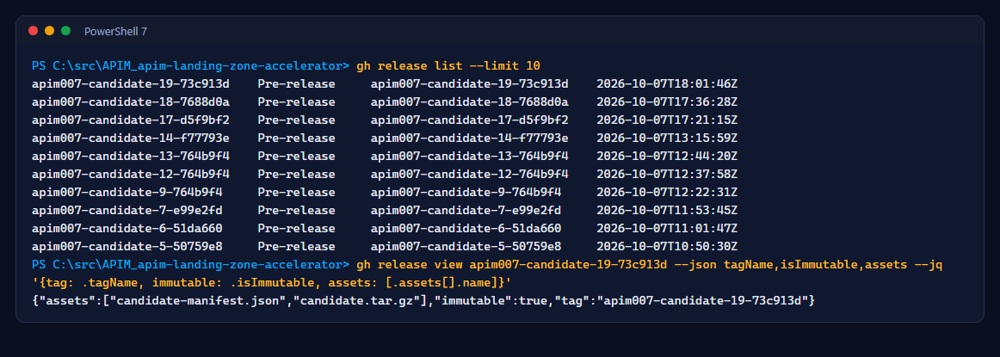
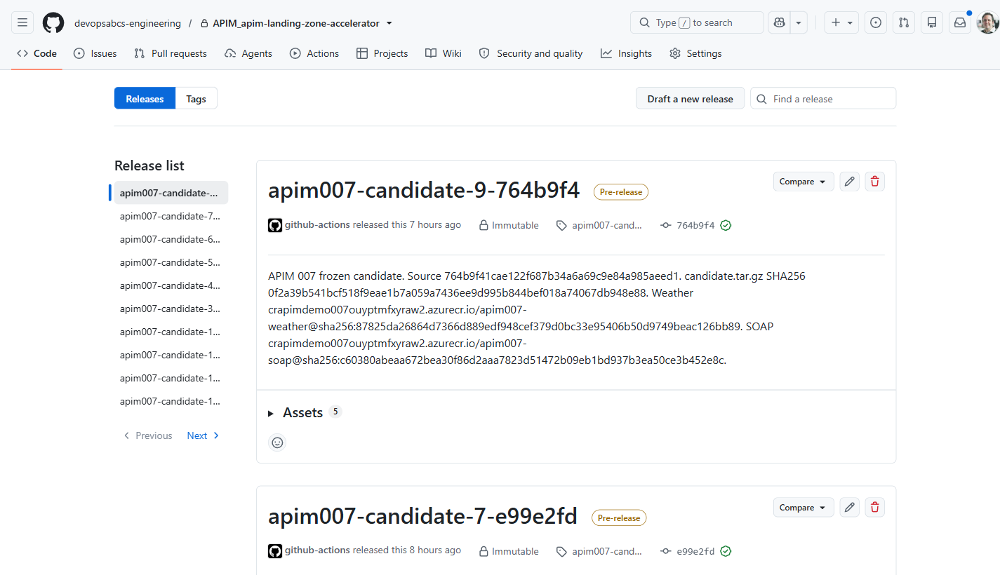
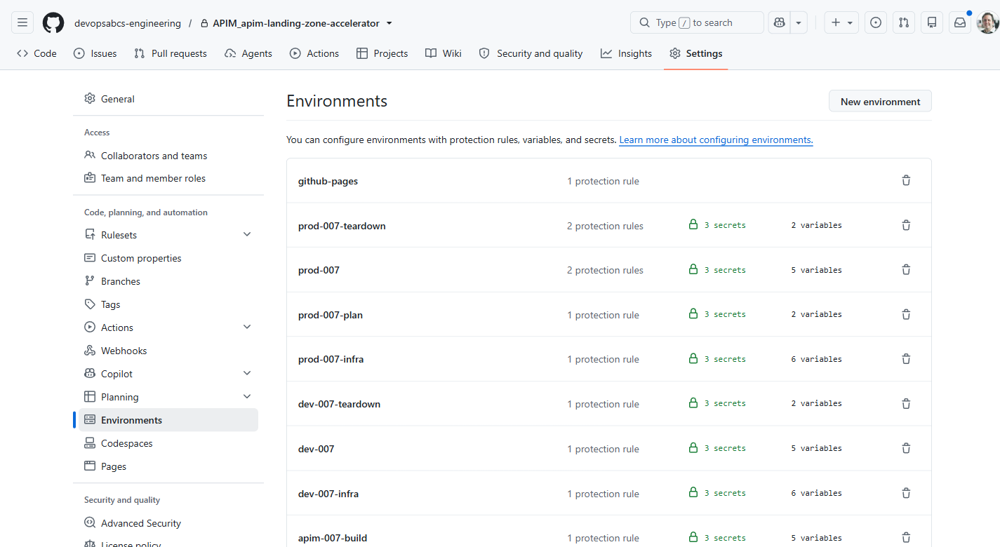
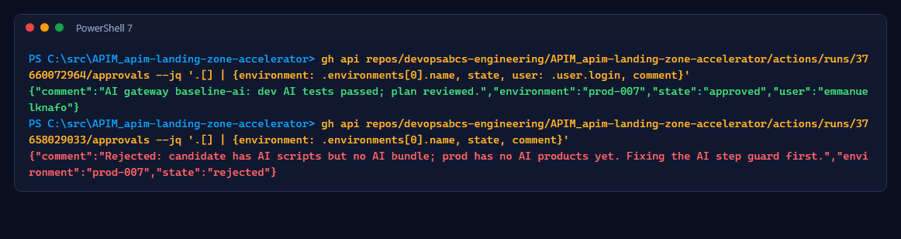
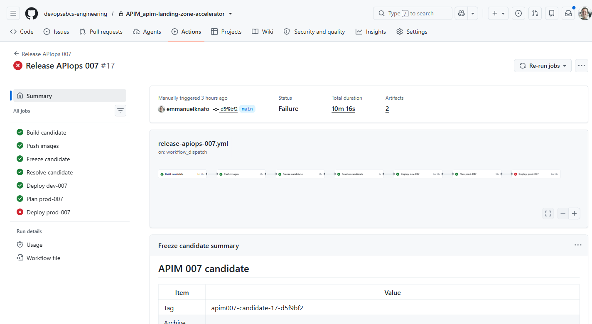
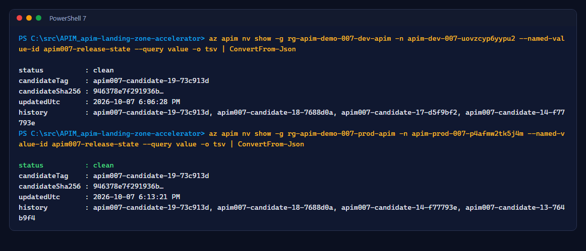

# Atelier 3 : Première version - candidat, dev, approbation, prod

<span class="chip phase-deploy"><span aria-hidden="true">🚀</span> Version</span> <span class="chip phase-idea">45 min</span> <span class="chip phase-plan">Intermédiaire</span>

## Aperçu

<div class="lab-meta" markdown>

| Élément | Détails |
|------|---------|
| **Durée** | 45 minutes (une version complète prend environ 25 minutes) |
| **Niveau** | Intermédiaire |
| **Prérequis** | [Atelier 2](lab-02-bundle.md) terminé |
| **Point de contrôle** | Les deux environnements `clean` sur la même étiquette de candidat |
| **Atelier suivant** | [Atelier 4 : Promotion A vers B](lab-04-promotion-a-to-b.md) |

</div>

Une fusion dans `main` qui touche le paquet, la configuration, l'outillage ou les scripts de publication démarre `release-apiops-007.yml`. Il construit **un** candidat et le promeut.

<figure class="anim-frame" markdown>

<figcaption>Le chemin de publication. La prod ne reçoit jamais rien que le dev n'a pas testé.</figcaption>
</figure>

## Objectifs d'apprentissage

À la fin de cet atelier, vous saurez :

* Suivre les sept travaux de publication et dire ce que chacun garantit.
* Trouver une version candidate et vérifier qu'elle est immuable.
* Lire le résumé du plan et approuver un déploiement en prod depuis l'interface GitHub ou la CLI.
* Lire l'état de version enregistré dans chaque service APIM.

## Étapes

### Étape 1 : Lancer la première publication et la suivre

Dans un dépôt neuf, rien n'a encore été fusionné : lancez donc la première publication à la main. Elle construit un candidat à partir du paquet de `main`, où chaque API renvoie `x-demo-release: baseline-a` (`baseline-ai` pour la passerelle IA). À partir de l'atelier 4, la fusion d'une demande de tirage lance la publication pour vous.

```powershell
gh workflow run release-apiops-007.yml --repo $Repo --ref main
gh run list --repo $Repo --workflow release-apiops-007.yml --limit 14
```

<figure class="screenshot-frame" markdown>

<figcaption>Historique des versions de l'exécution enregistrée, y compris des échecs provoqués volontairement (atelier 6).</figcaption>
</figure>

<figure class="screenshot-frame" markdown>

<figcaption>Le même historique dans GitHub.</figcaption>
</figure>

| Travail | Garantit |
|-----|------------|
| Build candidate | Les images se construisent, les contrats correspondent aux spécifications validées, le paquet est valide |
| Push images | Images poussées par condensé avec l'identité réservée à la poussée |
| Freeze candidate | `candidate.tar.gz` et son manifeste publiés comme préversion **immuable** |
| Resolve candidate | L'étiquette et le SHA256 exacts que chaque travail suivant doit utiliser |
| Deploy dev-007 | Déploiement, essai à blanc, publication, comparaison d'extraction, tests de passerelle, deuxième publication |
| Plan prod-007 | Lecture seule : substitutions de prod, barrières d'état de version, vérification de la protection de l'environnement |
| Deploy prod-007 | Après approbation : condensés revérifiés, puis les mêmes étapes qu'en dev |

<figure class="screenshot-frame" markdown>

<figcaption>Exécution <code>37660072964</code> : le candidat 18 en dev puis en prod.</figcaption>
</figure>

### Étape 2 : Inspecter le candidat figé

```powershell
gh release list --repo $Repo --limit 10
gh release view apim007-candidate-19-73c913d --repo $Repo --json tagName,isImmutable,assets --jq '{tag: .tagName, immutable: .isImmutable, assets: [.assets[].name]}'
```

<figure class="screenshot-frame" markdown>

<figcaption>Les candidats sont des versions immuables : leurs ressources et leurs étiquettes ne peuvent jamais changer.</figcaption>
</figure>

<figure class="screenshot-frame" markdown>

<figcaption>Le retour arrière (atelier 6) redéploie à partir de ces versions, pas d'artefacts de workflow.</figcaption>
</figure>

### Étape 3 : Approuver la prod

Quand `Plan prod-007` réussit, l'exécution attend sur l'environnement `prod-007`. Lisez d'abord le résumé du plan : candidat, validation source, passerelle de prod, condensés du manifeste et des substitutions, images.

Approuvez dans l'interface GitHub (**Review deployments**) ou depuis PowerShell :

```powershell
$runId = gh run list --repo $Repo --workflow release-apiops-007.yml --limit 1 --json databaseId --jq '.[0].databaseId'
$envId = gh api repos/$Repo/environments/prod-007 --jq '.id'
gh api -X POST repos/$Repo/actions/runs/$runId/pending_deployments -F "environment_ids[]=$envId" -f state=approved -f comment='Plan revu'
```

<figure class="screenshot-frame" markdown>

<figcaption><code>prod-007</code> : réviseur obligatoire et politique de branche limitée à <code>main</code>. Le travail de plan échoue si cette protection est affaiblie.</figcaption>
</figure>

```powershell
gh api repos/$Repo/actions/runs/37660072964/approvals --jq '.[] | {environment: .environments[0].name, state, user: .user.login, comment}'
```

<figure class="screenshot-frame" markdown>

<figcaption>Chaque approbation ou rejet est enregistré avec son commentaire.</figcaption>
</figure>

!!! human "Un rejet est un résultat valide"
    Dans l'exécution `37658029033`, le réviseur a **rejeté** la prod : le candidat contenait de nouveaux scripts dont les tests IA n'avaient encore rien à tester en prod. La prod est restée sur son candidat propre précédent. Le correctif est arrivé dans un nouveau candidat.

<figure class="screenshot-frame" markdown>

<figcaption>Exécution <code>37658029033</code> : dev réussi, prod rejetée par le réviseur.</figcaption>
</figure>

### Étape 4 : Lire l'état de version

Chaque service APIM conserve une valeur nommée non secrète `apim007-release-state` avec le candidat déployé, son condensé, le statut et l'historique des candidats propres :

```powershell
az apim nv show -g rg-apim-demo-007-prod-apim -n <prod-apim-name> --named-value-id apim007-release-state --query value -o tsv | ConvertFrom-Json
```

<figure class="screenshot-frame" markdown>

<figcaption>Valeurs de statut : <code>deploying</code>, <code>clean</code> ou <code>dirty</code>. La prod n'accepte qu'un candidat <code>clean</code> en dev.</figcaption>
</figure>

!!! checkpoint "Point de contrôle"
    Le dev et la prod affichent `status: clean` avec le même `candidateTag`, et les deux reçus (`receipt-dev-007`, `receipt-prod-007`) sont joints à l'exécution.
