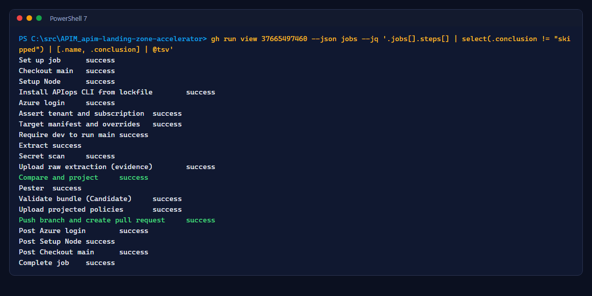
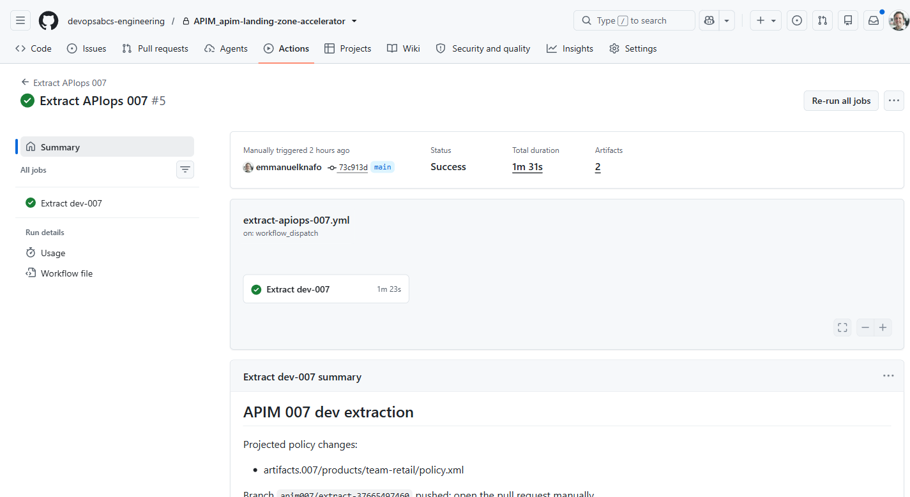
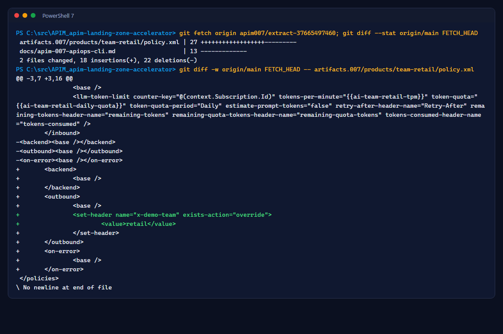
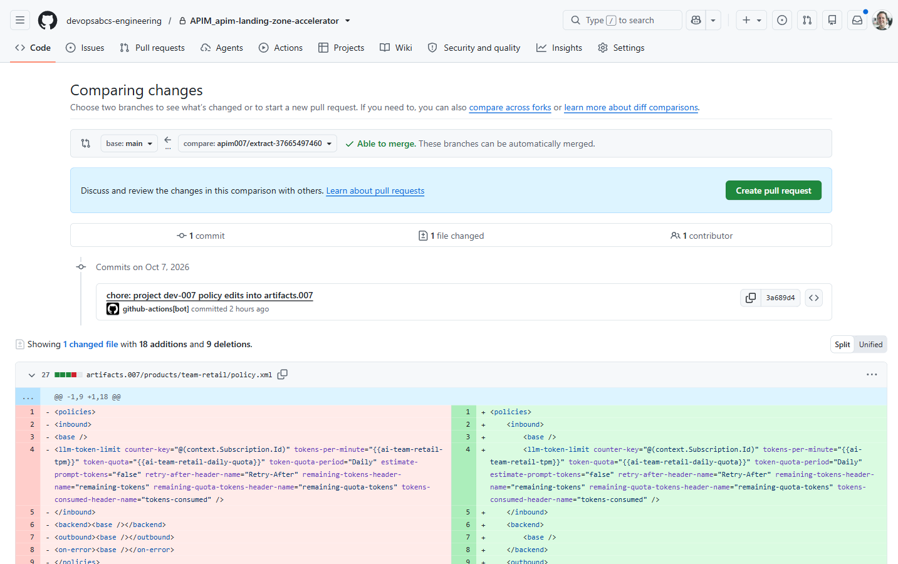
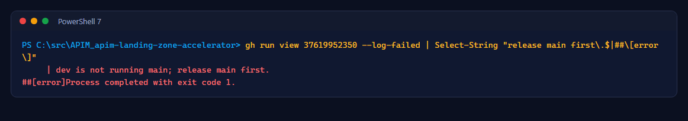

# Atelier 5 : GitOps par extraction - du portail à la demande de tirage

<span class="chip phase-prod"><span aria-hidden="true">🔁</span> Extraction</span> <span class="chip phase-idea">30 min</span> <span class="chip phase-plan">Avancé</span>

## Aperçu

<div class="lab-meta" markdown>

| Élément | Détails |
|------|---------|
| **Durée** | 30 minutes |
| **Niveau** | Avancé |
| **Prérequis** | [Atelier 4](lab-04-promotion-a-to-b.md) terminé, dev `clean` sur un candidat construit à partir de `main` |
| **Point de contrôle** | Une branche `apim007/extract-<run-id>` qui ne change que des fichiers `policy.xml` |
| **Atelier suivant** | [Atelier 6 : Retour arrière](lab-06-rollback.md) |

</div>

Des gens utilisent encore le portail. Le GitOps par extraction ramène une modification approuvée du dev dans Git, pour que la prochaine version l'apporte en prod par l'approbation normale, sans dérive silencieuse.

## Objectifs d'apprentissage

À la fin de cet atelier, vous saurez :

* Exécuter le workflow d'extraction réservé au dev.
* Expliquer les règles de sécurité : le dev doit exécuter `main`, seules les stratégies sont projetées, l'extraction brute n'est qu'une preuve.
* Revoir la branche projetée et décider de la fusionner ou non.

## Étapes

### Étape 1 : Faire une modification dans le portail dev

Dans le portail Azure, ouvrez le service API Management de dev, puis **Products** > **team-retail** > **Policies** (ou **APIs** > **Weather** > **All operations** > **Policies**). Ajoutez un en-tête de réponse dans la section outbound :

```xml
<set-header name="x-demo-team" exists-action="override">
    <value>retail</value>
</set-header>
```

Enregistrez.

### Étape 2 : Exécuter l'extraction

```powershell
gh workflow run extract-apiops-007.yml --repo $Repo
$runId = gh run list --repo $Repo --workflow extract-apiops-007.yml --limit 1 --json databaseId --jq '.[0].databaseId'
gh run watch $runId --repo $Repo
gh run view $runId --repo $Repo --json jobs --jq '.jobs[].steps[] | select(.conclusion != "skipped") | [.name, .conclusion] | @tsv'
```

<figure class="screenshot-frame" markdown>

<figcaption>Exécution <code>37665497460</code> : la modification a été détectée, projetée, testée et poussée.</figcaption>
</figure>

<figure class="screenshot-frame" markdown>

<figcaption>Le résumé du travail liste les fichiers de stratégie projetés.</figcaption>
</figure>

### Étape 3 : Revoir la branche projetée

```powershell
git fetch origin apim007/extract-$runId
git diff --stat origin/main FETCH_HEAD
git diff -w origin/main FETCH_HEAD -- artifacts.007/products/team-retail/policy.xml
```

<figure class="screenshot-frame" markdown>

<figcaption>Seul le fichier de stratégie a changé. Une dérive de point de terminaison, d'opération ou de schéma ferait plutôt échouer la comparaison.</figcaption>
</figure>

<figure class="screenshot-frame" markdown>

<figcaption>Ouvrez une demande de tirage depuis cette branche pour promouvoir la modification, ou supprimez la branche et rétablissez le dev.</figcaption>
</figure>

!!! info "Pourquoi pas une demande de tirage automatique?"
    Dans cette organisation, une politique empêche `GITHUB_TOKEN` de créer des demandes de tirage; le workflow pousse donc la branche et journalise un avertissement. Vous ouvrez vous-même la demande de tirage; elle exécute la validation normale.

### Étape 4 : Voir la règle de sécurité

L'extraction refuse de s'exécuter quand le dev n'exécute pas `main` (par exemple après un retour arrière), car une demande de tirage construite à partir d'un ancien candidat annulerait du travail plus récent :

```powershell
gh run view 37619952350 --repo $Repo --log-failed | Select-String "release main first"
```

<figure class="screenshot-frame" markdown>

<figcaption>Exécution <code>37619952350</code> : refus volontaire pendant que le dev exécutait un candidat de retour arrière.</figcaption>
</figure>

!!! checkpoint "Point de contrôle"
    Une branche `apim007/extract-<run-id>` poussée dont le diff ne touche que des fichiers `policy.xml`. Dans l'exécution enregistrée, la modification était une démo : le dev a été rétabli à la version du paquet et la branche conservée pour révision.
