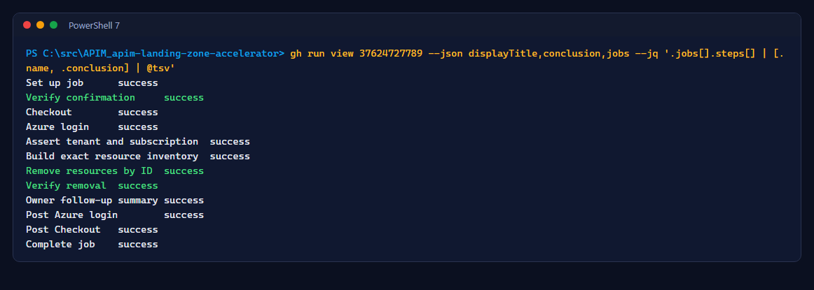
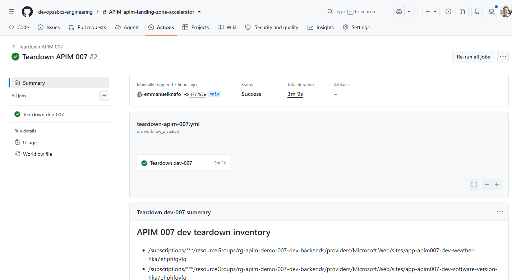

# Atelier 10 : Démantèlement et nettoyage

<span class="chip phase-human"><span aria-hidden="true">🧹</span> Démantèlement</span> <span class="chip phase-idea">20 min</span> <span class="chip phase-plan">Intermédiaire</span>

## Aperçu

<div class="lab-meta" markdown>

| Élément | Détails |
|------|---------|
| **Durée** | 20 minutes |
| **Niveau** | Intermédiaire |
| **Prérequis** | N'importe quel atelier précédent |
| **Point de contrôle** | L'étape *Verify removal* réussit; l'autre environnement est intact |
| **Suite** | [Index des preuves](../evidence.md) |

</div>

Le démantèlement ne supprime jamais de groupe de ressources et n'utilise jamais de caractères génériques. Il dérive les ID de ressources exacts des déploiements fixes, vérifie chaque étiquette, puis supprime seulement ces ID.

## Objectifs d'apprentissage

À la fin de cet atelier, vous saurez :

* Démanteler un environnement avec une confirmation explicite.
* Lire l'inventaire supprimé et la liste de suivi pour le Propriétaire.
* Récupérer après la suppression réversible d'API Management et des comptes IA.

## Étapes

### Étape 1 : Démanteler le dev

```powershell
gh workflow run teardown-apim-007.yml --repo $Repo -f environment=dev -f confirm=delete-apim-007-dev
```

Le démantèlement de la prod exige `confirm=delete-apim-007-prod` et l'approbation d'un réviseur sur `prod-007-teardown`.

Pour supprimer les deux environnements en une seule exécution, choisissez `all`. L'exécution lance un travail par environnement; le travail de prod attend toujours son réviseur :

```powershell
gh workflow run teardown-apim-007.yml --repo $Repo -f environment=all -f confirm=delete-apim-007-all
```

### Étape 2 : Lire l'inventaire et le résultat

```powershell
gh run view <run-id> --repo $Repo --json jobs --jq '.jobs[].steps[] | [.name, .conclusion] | @tsv'
```

<figure class="screenshot-frame" markdown>

<figcaption>Exécution <code>37624727789</code> : la répétition du démantèlement du dev.</figcaption>
</figure>

<figure class="screenshot-frame" markdown>

<figcaption>Le résumé liste chaque ID supprimé et les actions de suivi pour le Propriétaire.</figcaption>
</figure>

### Étape 3 : Gérer les ressources supprimées de façon réversible

API Management et les comptes IA restent en suppression réversible pendant 48 heures, et leurs noms dérivent du groupe de ressources : reprovisionner le même environnement échoue tant que ces enregistrements existent. Aucun workflow ne les purge; le Propriétaire le fait volontairement :

```powershell
az apim deletedservice purge --service-name <apim-name> --location $Location
az cognitiveservices account purge --location canadaeast --resource-group rg-apim-demo-007-dev-apim --name <account-name>
```

Restaurez ensuite l'environnement avec `infra-apim-007.yml` (`target=dev`) et une version depuis `main`.

### Étape 4 : Tout nettoyer à la fin

1. Démantelez les deux environnements (`environment=all`).
2. Supprimez les cinq groupes de ressources `rg-apim-demo-007-*` dans le portail (cela supprime aussi les identités et le registre).
3. Supprimez le budget et les neuf environnements GitHub.

!!! checkpoint "Point de contrôle"
    *Verify removal* a réussi, et la passerelle de l'autre environnement répond toujours.
